# 02 — Architecture

> **Status:** Founding architecture. Diagrams are normative intent, not committed code.
> **Read with:** [01 — Feature Plan](01-feature-plan.md) (what) · [03 — Roadmap](03-roadmap.md) (when) · [ADR index](adr/README.md) (decisions behind each box).

This document describes Stele's system architecture from the wire down to the bytes (and out to object storage), plus the later distribution plan. Diagrams are [Mermaid](https://mermaid.js.org/) and render on GitHub.

> **Guardrail in architectural form:** the storage engine is **columnar-first with an adequate point-access path**, not a row store with columns bolted on. Every layout decision favors scans, temporal range pruning, and append throughput over single-row write latency. See [Charter §3](00-charter.md#3-the-guardrail--lead-with-the-non-goal).

---

## 1. System overview

Five layers, top to bottom: **wire front end → query layer → transaction & catalog → storage engine → physical storage (local + object store).** A lineage/provenance subsystem and an observability subsystem run alongside.

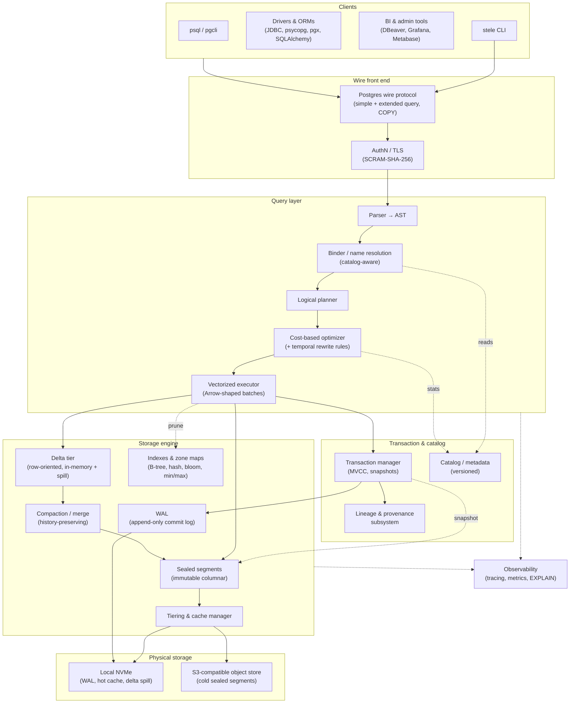

**Reading the picture:** a query enters over pg-wire, is parsed/bound/planned/optimized, and executes against a **consistent MVCC snapshot**. Reads merge the row-oriented **delta tier** (recent writes) with the columnar **sealed segments** (the bulk), pruning with zone maps and indexes. Writes append to the WAL and the delta tier; compaction later folds the delta into new immutable segments; tiering moves cold segments to object storage. Provenance is captured at commit.

---

## 2. The bitemporal record model

This is the conceptual heart. Every logical row is a **chain of versions**, each tagged on two independent time axes.

- **System time** `[sys_from, sys_to)` — when the *database* held this version. Always present. Set by the committing transaction. Half-open intervals; `sys_to = +∞` (a sentinel "until changed") for the current version.
- **Valid time** `[valid_from, valid_to)` — when the fact is *true in the modeled world*. Per-table opt-in. Supplied by the writer.

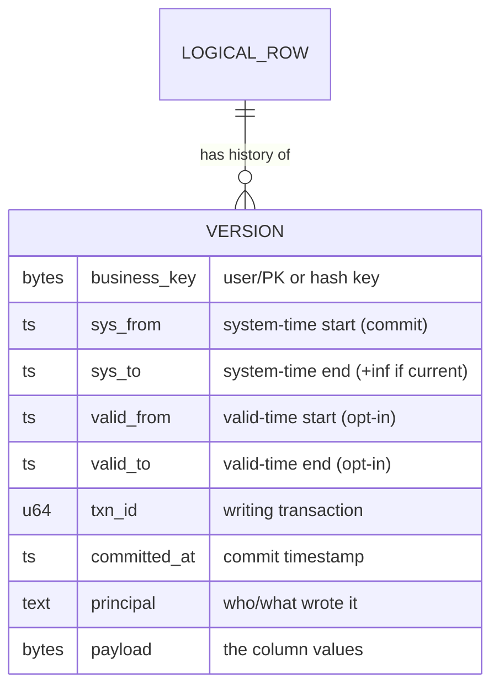

A **bitemporal query** picks a point (or range) on each axis. "As we believed on 2026-01-31 (system), about the state of the world on 2026-01-15 (valid)" selects, per business key, the version whose `sys` interval contains 2026-01-31 *and* whose `valid` interval contains 2026-01-15.

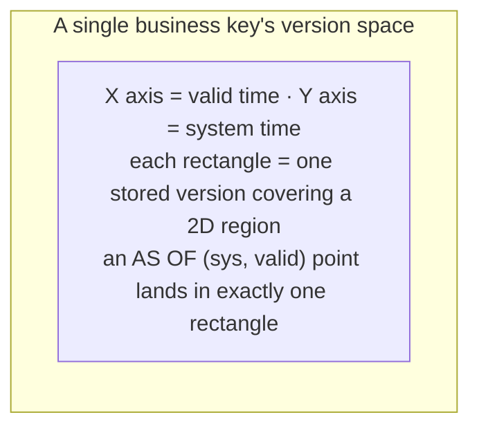

> Because corrections *append* a new version (closing the prior one on the **system** axis while possibly back-dating on the **valid** axis), Stele can always answer "what did we think then" and "what was actually true then" independently. This is the property that makes audit and retroactive correction trivial — and it is why the store is append-only ([ADR-0002](adr/0002-on-disk-storage-format.md)).

---

## 3. Storage engine internals

### 3.1 Tiered layout (LSM-flavored, history-preserving)

Stele uses an **LSM-inspired** two-tier shape, adapted so that compaction **never discards history**:

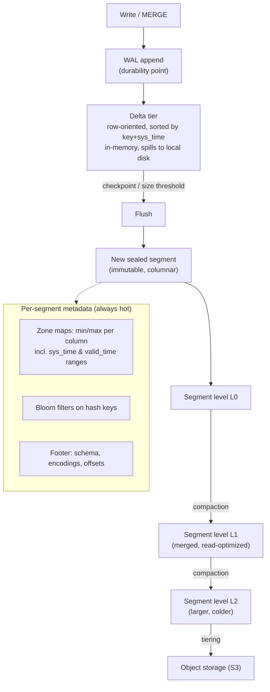

**Key differences from a vanilla LSM:**
- Compaction merges and re-encodes for read efficiency but **retains every version** (unless an explicit, audited retention policy says otherwise — off by default).
- Segments are sorted/clustered by `(business_key, sys_from)` so a key's version chain is physically local and time-range pruning is cheap.
- "Tombstones" are **logical period-closes**, not deletions; they carry their own provenance.

### 3.2 On-disk segment format

A sealed segment is an **immutable, self-describing columnar file** (Stele's own format — see [ADR-0002](adr/0002-on-disk-storage-format.md)), conceptually Parquet/ORC-like but designed around the bitemporal record and append-only segments:

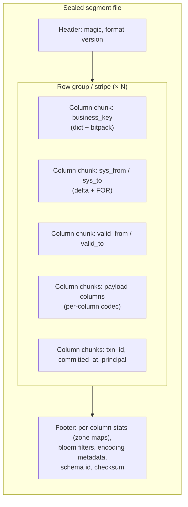

- **Self-describing & versioned:** the header carries a format version; the footer carries the schema id (so the [versioned catalog](#5-catalog--metadata) can interpret old segments after schema evolution).
- **Checksummed:** page- and footer-level checksums; corruption is detectable (and tested against torn-write models in [06](06-testing-strategy.md)).
- **Codec per column:** dictionary, RLE, bit-packing, frame-of-reference, delta — chosen by the writer from column statistics.
- **Provenance columns are first-class**, not a side table — they compress well (txn_id is monotonic; committed_at is delta-friendly).

### 3.3 How B-tree and columnstore coexist

The columnstore is the **primary** structure (scans, aggregation, temporal range). The B-tree/hash indexes are **secondary, optional access paths** that map a key (or hash key) to the segment + row-group where its current/version rows live — giving *adequate* point lookups without compromising the columnar layout.

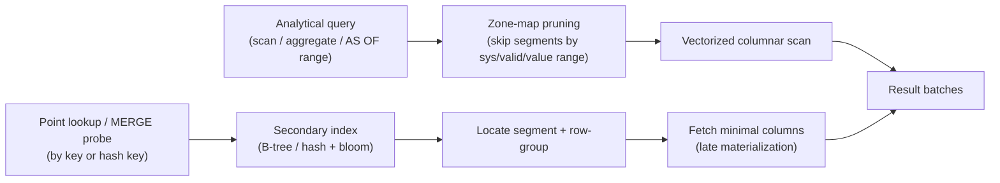

The columnstore never depends on the secondary indexes for correctness — they are an accelerator. Drop them and analytical queries are unaffected; only point lookups slow down. This keeps the **asymmetric performance contract** honest.

### 3.4 Write path (sequence)

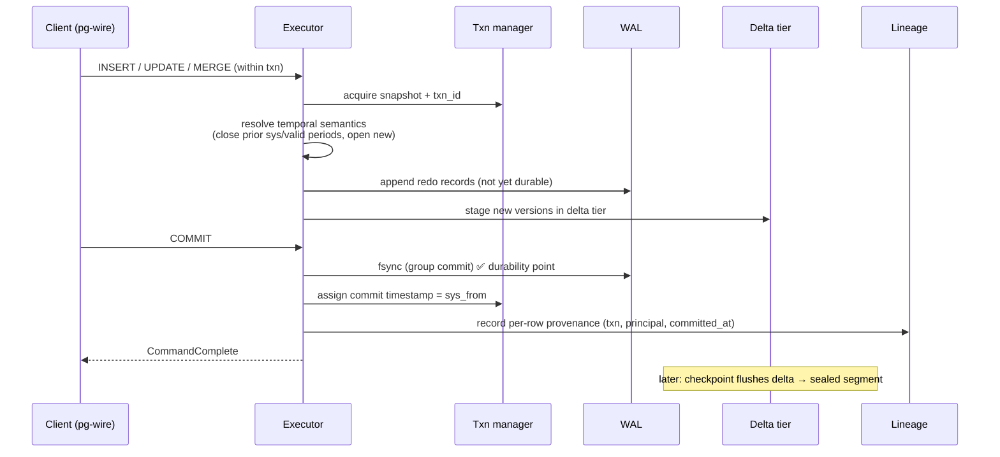

The **durability point is the WAL fsync at commit.** Everything after (delta→segment flush, compaction, tiering) is asynchronous and recoverable from the WAL.

### 3.5 Read path / as-of (flow)

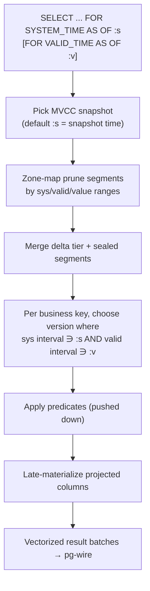

### 3.6 Crash recovery

On startup: validate segments by checksum, find the last checkpoint, **replay the WAL** forward (idempotently) to reconstruct the delta tier and re-open period sentinels, then resume. Recovery is **deterministic** and is exercised under fault injection in the [simulation harness](06-testing-strategy.md).

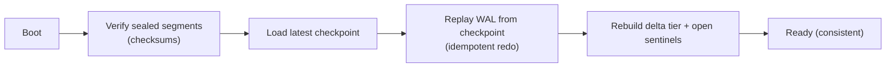

---

## 4. Object-storage tiering & storage/compute separation

Cold sealed segments live in an **S3-compatible object store** behind a pluggable backend trait (`local`, `memory`, `s3`). A **hot cache** on local NVMe holds recently/frequently read segments. Metadata (catalog, segment index, zone maps) stays resident.

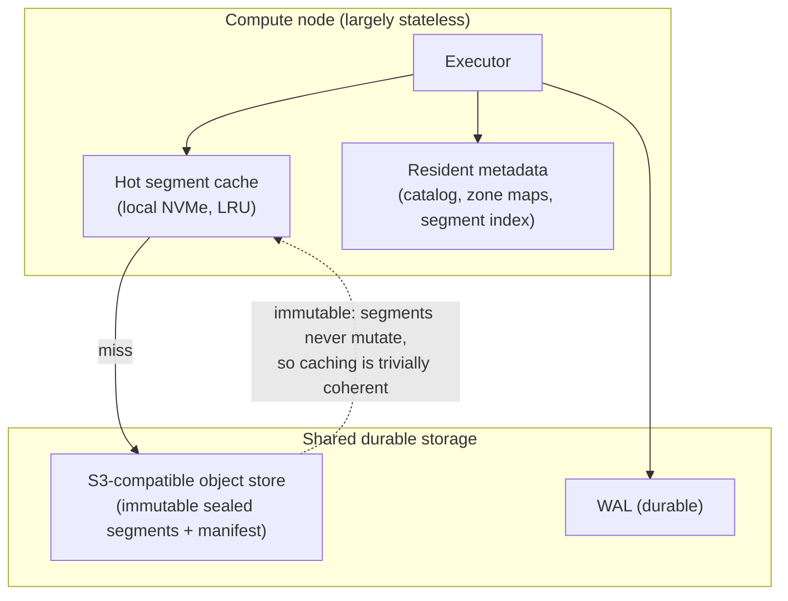

Because segments are **immutable**, cache coherence is free: a cached segment can never be stale. This is a direct dividend of the append-only design and is what makes storage/compute separation (and, later, multiple stateless readers over one dataset) clean. See [ADR-0007](adr/0007-storage-compute-separation.md).

### Storage lifecycle: tiered archival (controlling append-only growth)

Append-only means total data volume only grows — so without a cost strategy, object-storage bills grow unbounded. Stele manages this with **tiered archival** ([ADR-0021](adr/0021-storage-lifecycle-tiered-archival.md)), which is *distinct from retention/expiry* ([01 §A.2](01-feature-plan.md#a2--append-only--immutable-storage--historization)): tiering **keeps every byte** (append-only + audit guarantees intact) and only moves cold data to cheaper storage.

The bitemporal model supplies a **principled staleness signal for free**: **system-time age** tells the engine exactly which versions are *superseded history* vs *current*. Current versions stay hot; superseded versions age **down** the tier ladder. Compaction clusters segments by **time-era**, so a cold segment is *purely* old history and never drags a live row into archive.

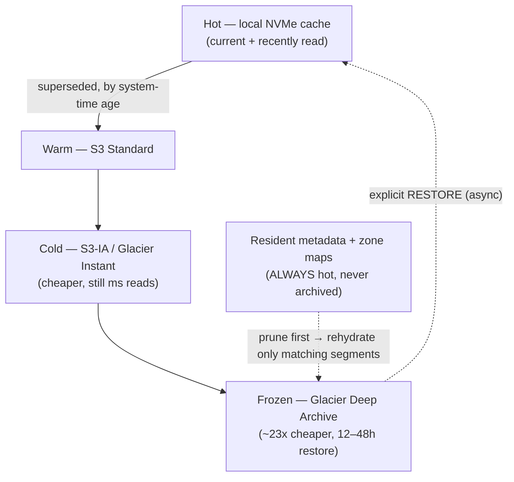

Two properties keep retrieval cheap and predictable:

- **Metadata and zone maps are never archived.** An `AS OF` query prunes against resident zone maps *first* and only rehydrates the handful of segments that actually match — you never thaw a whole partition to answer a narrow query.
- **Frozen data needs an explicit, async restore.** The **tier-aware planner** detects when a query would touch Glacier-class data and returns `restore required` + a handle (with a cost/latency estimate) rather than silently hanging for hours; the user issues a `RESTORE` (or admin-API) call to rehydrate, then re-queries. Cold tiers with millisecond retrieval (S3-IA / Glacier Instant) are read transparently.

Tiering is **engine-native and pluggable**: Stele decides per-segment placement (by system-time/policy) and sets the storage class on write/migration, working across any S3-compatible backend; delegating to S3 Intelligent-Tiering is an optional backend mode. Policy is configurable per namespace/table with conservative defaults — no surprise archival. Crucially, **the data always still exists** — archival changes cost and latency, never durability or auditability.

---

## 5. Catalog & metadata

The catalog is **itself versioned** (it lives on the same bitemporal substrate conceptually), so that **time-travel survives schema changes**: an `AS OF` read in the past resolves columns using the schema that was in effect *then*.

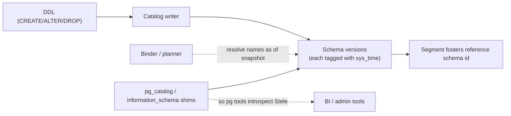

The catalog also exposes **`pg_catalog`/`information_schema` shims** so the Postgres ecosystem's introspection (and thus drivers/BI tools) works against Stele.

**Namespaces as isolation + lifecycle units.** Schemas/namespaces are a first-class boundary: each can carry its own [encryption key, residency, and access policy](10-security-and-compliance.md#9-hardening--operational-security), and supports an **audited drop** that decommissions a whole namespace as a clean break — the basis for tenant offboarding and [namespace-drop erasure](10-security-and-compliance.md#the-append-only-vs-right-to-erasure-tension-handled-not-hand-waved). This is a *general* tenancy primitive: the app (e.g., Solvia) maps tenants to namespaces; the engine never knows what a tenant *is* ([ADR-0009](adr/0009-data-vault-conceptual-seam.md), [ADR-0020](adr/0020-crypto-shredding-erasure.md)).

---

## 6. Query layer

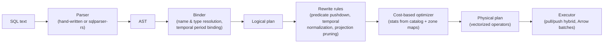

- **Parser:** start from `sqlparser-rs` to move fast, with Stele-specific temporal grammar; revisit a hand-written parser only if needed.
- **Optimizer:** rule-based first (pushdown, pruning, temporal predicate normalization), cost-based as statistics mature. **Temporal-aware rules** are the differentiating part — e.g., pushing an `AS OF` predicate into segment-level `sys_time` zone-map pruning.
- **Executor:** vectorized, batch-at-a-time over **Arrow-shaped** columnar batches ([assumption A7](assumptions.md)) for SIMD-friendliness and ecosystem interop. The execution core is written to run under the deterministic simulation scheduler ([06](06-testing-strategy.md)).

---

## 7. Postgres wire-protocol front end

Adopting the [Postgres wire protocol](https://www.postgresql.org/docs/current/protocol.html) inherits the entire driver/ORM/BI/admin ecosystem — the single highest-leverage adoption decision ([ADR-0003](adr/0003-postgres-wire-protocol-early.md)). It lands **early and incrementally**.

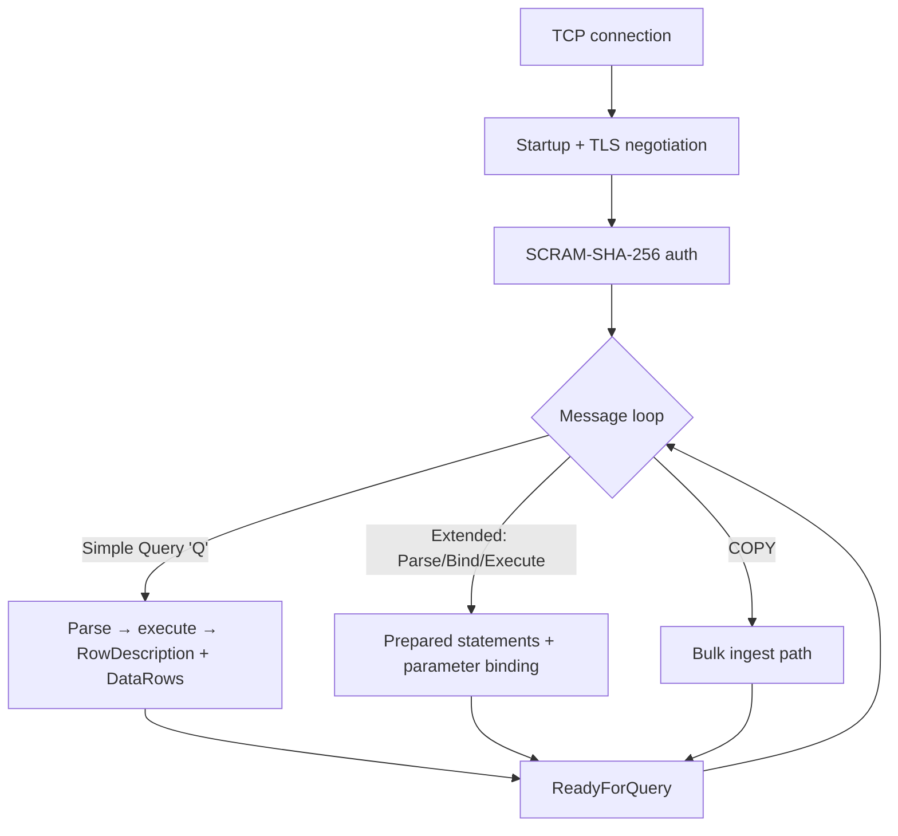

**Phasing:** *simple query* in **v0.1** (so `psql` connects and runs `SELECT`/`INSERT`); *extended query* (prepared/bind) in **v0.2** (drivers/ORMs need it); *COPY* in **v0.3**. Temporal SQL extensions ride on top of standard pg syntax where they don't conflict; where SQL:2011 and Postgres diverge, the choice is documented ([assumption A9](assumptions.md)).

> We implement the **protocol**, not Postgres's semantics wholesale. Stele is not Postgres-compatible at the planner/MVCC level — it is wire- and introspection-compatible enough to inherit tooling. That boundary is deliberate and documented in [ADR-0003](adr/0003-postgres-wire-protocol-early.md).

---

## 8. Lineage & provenance subsystem

Provenance is captured at **commit** and stored **inline** with each version (not in a side audit table):

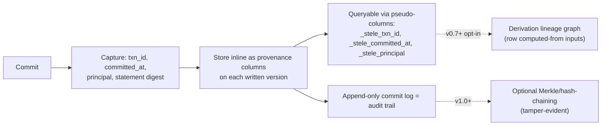

Two tiers of provenance:
1. **Per-row transaction provenance** (Must, v0.2): who/what/when wrote each version. Cheap, always-on.
2. **Derivation lineage** (Later, opt-in, v0.7+): a graph of "this row was computed from those inputs by that statement." Powerful but expensive; off by default. See [01 §A.4](01-feature-plan.md#a4--lineage--provenance-first-class).

This is the substrate that makes audit *and* Data Vault cheap to build **on top of Stele** — without Stele knowing what a hub or a claim is ([ADR-0009](adr/0009-data-vault-conceptual-seam.md)).

---

## 9. Transaction & concurrency model

MVCC is layered directly on the append-only store, which already *is* a multi-version store ([ADR-0008](adr/0008-mvcc-on-append-only.md)):

- A transaction reads a **snapshot** = a system-time point; it sees, per key, the latest version whose `sys` interval contains the snapshot.
- Writes append new versions with `sys_from = commit_time`; **snapshot isolation** is the v1 default.
- Conflicts (write-write on the same key within overlapping snapshots) are detected and the loser retries.
- **Serializable (SSI)** is a later opt-in (v0.7).
- Garbage *is not* collected by default (append-only); space management is via tiering and explicit, audited retention policies only.

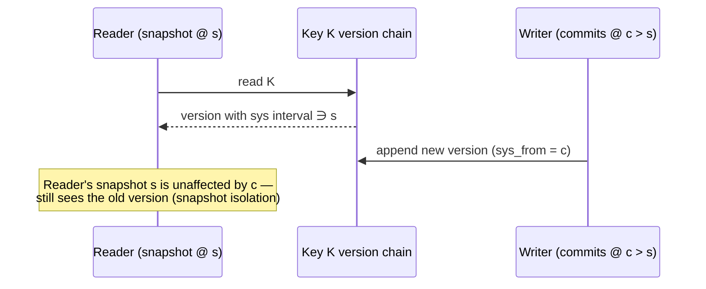

---

## 10. Distribution & consensus (later phase)

Distribution is **designed-for, built-later** (Charter §3, [ADR-0006](adr/0006-distribution-later-shared-storage.md)). The intended shape leans on the immutable + shared-object-storage foundation: **stateless-ish compute over shared storage**, with **Raft** for control-plane metadata consensus — *not* a from-scratch Paxos or a TrueTime-style clock.

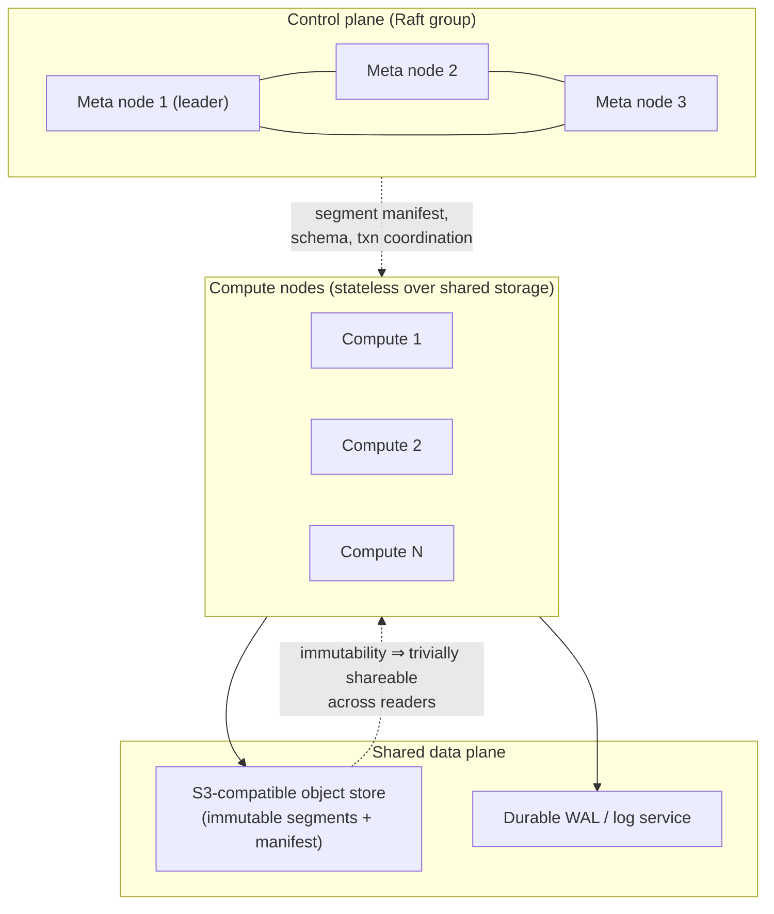

Why this shape: immutable segments mean **read scale-out is nearly free** (any node can read any cached segment with no coherence protocol). The hard part — and what Raft solves — is agreeing on *which segments are current* (the manifest) and coordinating commit order. Consistency for this phase is validated with **Jepsen-style testing before any multi-node production claim** ([06](06-testing-strategy.md), Charter §8).

**Data distribution & co-location.** Within this shape, a table may declare a **distribution key** — typically a [stable hash key](01-feature-plan.md#a5--hash-keys--mergeupsert) — and rows partition across nodes by its hash; frequently-joined tables can be **co-located** (co-partitioned on the same key) so those joins stay node-local with no shuffle. These are generic sharded-analytics primitives, but they are deliberately part of the [integration groundwork](adr/0011-hash-distribution-integration-groundwork.md) ([ADR-0011](adr/0011-hash-distribution-integration-groundwork.md)): they make hash-keyed models — Data Vault among them — distribute and join cleanly, while the engine stays ignorant of what a hub or satellite is ([ADR-0009](adr/0009-data-vault-conceptual-seam.md)).

---

## 11. Crate / module decomposition (intended)

A Cargo workspace; boundaries chosen so the **deterministic storage core** can run under the simulation harness independent of the async runtime ([assumption A13](assumptions.md)).

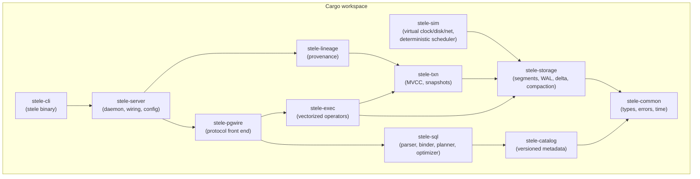

> The `stele-sim` crate provides the injectable virtual clock, deterministic RNG, and simulated disk/network that the storage/txn core runs against — the FoundationDB/TigerBeetle pattern ([06](06-testing-strategy.md)). Keeping the core runtime-agnostic is an architectural constraint, not an afterthought.

---

## 12. Cross-cutting architectural invariants

These are test-enforced ([06](06-testing-strategy.md)) and amendable only via ADR:

1. **No in-place mutation of a sealed segment.** Ever.
2. **The WAL fsync is the only durability point.** Everything downstream is recoverable from it.
3. **Immutability ⇒ trivial cache/replica coherence.** No segment is ever stale.
4. **System-time is always present; valid-time is per-table opt-in.** ([assumption O3](assumptions.md))
5. **Provenance is inline and captured at commit**, never reconstructed after the fact.
6. **The columnstore is correct without any secondary index.** Indexes are accelerators only.
7. **The storage/txn core is deterministic** and runnable under the simulation scheduler.
8. **History within a dataset is immutable; a whole namespace has a lifecycle.** Sealed segments are never rewritten (invariant 1), but creating and *dropping* an entire namespace is a legitimate, audited, coarse operation — a drop is implemented as destroying the namespace's key, not mutating segments ([ADR-0020](adr/0020-crypto-shredding-erasure.md)).

Each box in the diagrams above traces to an [ADR](adr/README.md); each ADR traces back to the [Charter](00-charter.md).
