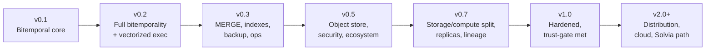
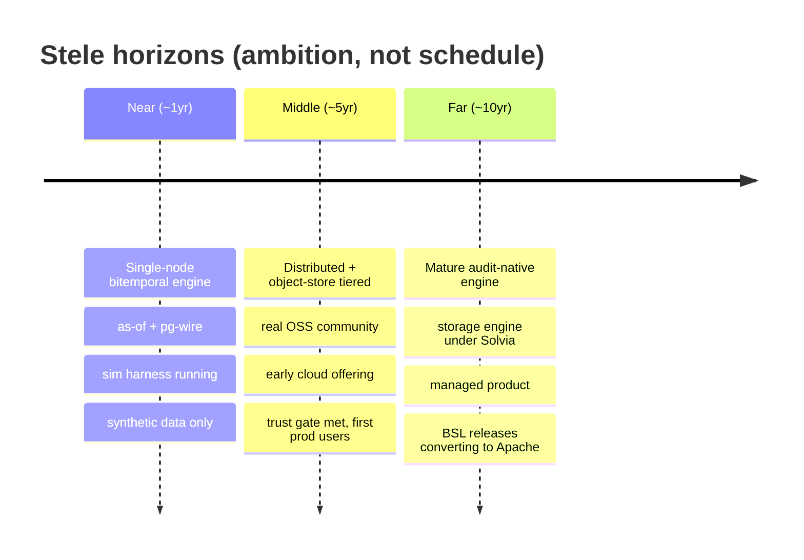

# 03 — Roadmap

> **Status:** Directional. **No calendar dates** — this is a no-deadline, slow-churn craft track ([Charter §1](00-charter.md#1-what-stele-is)). The *order* is the commitment; the *pace* is whatever quality demands.
> **Read with:** [01 — Feature Plan](01-feature-plan.md) (the feature-to-milestone table) · [02 — Architecture](02-architecture.md) · [06 — Testing Strategy](06-testing-strategy.md) (the trust gate).

This document defines what the version numbers *mean*, the ordered sequence of milestones, and the 1-year / 5-year / 10-year vision. Sequence is driven by dependency and by the rule **"the temporal core must be correct before anything is built on it."**

---

## Versioning

Stele follows **Semantic Versioning** intent, with pre-1.0 numbers signaling *capability depth*, not API stability:

| Series | Meaning | Stability promise |
|---|---|---|
| **v0.x** | Pre-release. The engine is taking shape. **On-disk format and SQL surface may break between minor versions** (with a documented migration each time). | None promised; breaking changes allowed, always documented. |
| **v1.0** | The single-node (+ read-replica) engine is **hardened, documented, and semver-stable**. The on-disk format is **forward-compatible from here**. The [trust gate](00-charter.md#8-the-trust-gate-no-production-data-stated-plainly) is met for first production use. | Format stability; semver; deprecation policy. |
| **v2.0+** | Distribution era. New major because the deployment model changes (multi-node, consensus). | Semver maintained; format migrations supported. |

**The three anchor releases, in one line each:**

- **v0.1 — "It is what it claims to be."** A single-node engine that demonstrates the *identity*: append-only bitemporal storage with as-of queries you can run from `psql`.
- **v0.5 — "It is a real database."** Object-store tiering, the full analytical SQL surface, security, backup/PITR, and a verified driver ecosystem.
- **v1.0 — "You can trust it."** Hardened, documented, semver-stable, audit-verifiable, trust-gate-met single-node engine.

---

## Milestone sequence (ordered, undated)

Each milestone has an **exit criterion** — the thing that must be *true and tested* before the next begins. The criteria, not the calendar, gate progress.

### v0.1 — Bitemporal core (the identity proof)
*The minimum-interesting demo ([assumption A3](assumptions.md)).*

- Append-only columnar segment store + row-oriented delta tier + WAL.
- **System-time and valid-time storage**; logical insert/update/delete.
- **`SELECT … FOR SYSTEM_TIME AS OF`** — time-travel as a query.
- Core DML/DDL; the essential scalar + temporal type set.
- **Crash recovery** via WAL replay.
- **Minimal pg-wire (simple query):** `psql` connects and runs `CREATE`/`INSERT`/`SELECT`.
- `stele` CLI seed; structured logging.
- Deterministic simulation harness scaffolding ([06](06-testing-strategy.md)) — even thin, it starts here.

> **Exit criterion:** from a clean clone, a contributor can start the engine, connect with `psql`, insert rows, *update one*, and run an `AS OF` query that returns the **pre-update** value — and a kill-during-write test recovers to a consistent state. The identity is demonstrable.

### v0.2 — Full bitemporality + vectorized execution
- Bitemporal tables (both axes together) + **temporal DDL** + period types.
- **Vectorized executor**, zone maps, joins/`GROUP BY`/aggregates.
- **MVCC + snapshot isolation**, multi-statement transactions.
- **Per-row provenance** (who/what/when), inline.
- **Hash keys**; pg-wire **extended query** (prepared statements) so drivers work.
- Immutable-segment invariant test-enforced.

> **Exit criterion:** a bitemporal `AS OF (system, valid)`-shaped workload returns provably correct results under the [correctness oracle](06-testing-strategy.md), and a JDBC/psycopg driver can run a parameterized query.

### v0.3 — Historization, indexing, and operability
- **Temporal `MERGE`/upsert** + bulk ingest (`COPY`).
- Bitemporal `AS OF` joins; subqueries/CTEs; `EXPLAIN ANALYZE`.
- **B-tree / hash / bloom** secondary indexes (adequate point access).
- **Compaction** (history-preserving) + checkpoints.
- **Backup/restore**; **pluggable storage backends** (local/memory/s3 traits).
- AuthN (SCRAM) + TLS; Prometheus metrics; health endpoints.

> **Exit criterion:** a million-row historized `MERGE` workload compacts without losing a single version; backup→restore round-trips byte-for-byte; metrics and `EXPLAIN ANALYZE` are usable for debugging.

### v0.5 — "A real database" (the second anchor)
- **Object-store cold tier + local hot cache**; incremental backup; **PITR**.
- **Change-feed / diff-between-two-times**; window functions; recursive CTEs.
- **RBAC**; access auditing; idempotent ingest.
- **Temporal integrity** (temporal PK/FK).
- **Driver/ORM compatibility matrix** verified (psql, JDBC, psycopg, pgx, SQLAlchemy).
- `pg_catalog`/`information_schema` shims (BI-tool introspection begins to work).

> **Exit criterion:** Stele runs a sustained analytical workload reading mostly from object storage, survives the simulation suite's fault injection over long runs, and a real third party can point a standard Postgres driver at it and build something.

### v0.7 — Separation, replication, and depth
- **Storage/compute separation** (stateless-ish compute over shared storage).
- **Read replicas** (WAL streaming); **serializable (SSI)** opt-in.
- **Derivation lineage** (opt-in); row/column security; encryption at rest.
- **BI/admin tool compatibility** (DBeaver, Grafana, Metabase) validated.

> **Exit criterion:** two compute nodes serve reads over one shared object-store dataset with no coherence bugs (immutability dividend), and a BI tool dashboards live against Stele.

### v1.0 — Hardened & trustworthy (the third anchor)
- Semver-stable API + **forward-compatible on-disk format** from here.
- **Cryptographic audit verifiability** (Merkle/hash-chained commits).
- Synchronous-replication groundwork; extension API v1.
- Complete docs site; security posture documented; deprecation policy.
- **The [trust gate](00-charter.md#8-the-trust-gate-no-production-data-stated-plainly) is formally met** → first production use becomes *permissible*.

> **Exit criterion:** the trust gate's checklist (sim/oracle/recovery/backup/community) is fully green, the format is frozen-forward, and an external auditor could verify history integrity cryptographically.

### v2.0+ — Distribution era
- **Raft control plane + shared-object-storage data plane** ([ADR-0006](adr/0006-distribution-later-shared-storage.md)).
- Distributed query execution; **Jepsen-validated** consistency.
- Managed/cloud offering groundwork; the path toward **hosting Solvia**.

> **Exit criterion:** a multi-node cluster passes Jepsen-style consistency testing under partition/clock-skew faults *before* any distributed production claim.

---

## Artifact / product roadmap

The engine milestones above drive a parallel schedule of **shipped artifacts and products** ([08](08-packaging-distribution-and-releases.md), [09](09-ecosystem-and-products.md)). "Later" never means "unplanned" — each artifact has a home in the sequence.

| Milestone | Artifacts & products that land |
|---|---|
| **v0.1** | `stele-server` binary · `stele` CLI/REPL · tagged Docker images (`ghcr.io`) · GitHub Releases (signed) · edge/nightly channel. |
| **v0.2** | Extended-protocol clients verified · self-update for binaries · beta/RC channel established. |
| **v0.3** | `stele-client` Rust SDK (crates.io) · **admin/control-plane API** (minimal: health, backup) · docs site online (`docs.steledb.com`, versioned) · marketing site + **WASM playground** (`steledb.com`) · OS package repos begin (Homebrew/apt/rpm). |
| **v0.5** | **Helm chart** (OCI) · cloud-storage-tiered images · driver/BI compatibility matrix published. |
| **v0.7** | **Kubernetes operator** (OLM, OperatorHub) · **Stele Studio desktop app** (Tauri) preview · admin API broadened for lifecycle. |
| **v1.0** | Desktop app GA-quality · **OpenShift certification** · thin language SDKs (Python/TS/Go) · signed/SBOM/SLSA across every artifact · stable LTS discussion. |
| **v2.0+** | Distributed-cluster operator management · **cloud marketplace images** (AMI/GCP/Azure) · managed/cloud offering · the analytics-workflow phase of Studio. |

Versioning and compatibility across this whole set is governed by [ADR-0014](adr/0014-release-channels-and-versioning-policy.md); distribution mechanics are in [08](08-packaging-distribution-and-releases.md).

---

## The 1 / 5 / 10-year vision

These are **horizons of ambition**, not schedules. "Year" is shorthand for "the near / middle / far arc."

### ~1 year — A single-node engine with a soul
A working **single-node engine** with the **bitemporal core**, a usable analytical **SQL surface**, and **pg-wire** so people can connect with tools they already have. It demonstrably does the thing nothing else does cleanly: *as-of and bitemporal queries that are correct and fast.* Roughly **v0.1 → v0.3**, reaching toward v0.5. The deterministic simulation harness is running. No production data — synthetic and contributor data only. The story a stranger can tell after five minutes: "It's a database where time-travel and audit are free."

### ~5 years — Distributed, tiered, and trusted-in-the-open
A **distributed, object-store-tiered** engine with **storage/compute separation**, a **real (if modest) open-source community**, and an **early cloud offering**. Roughly **v0.5 → v1.0 → early v2.0**. The trust gate has been met; the first careful production users exist. Stele is *known* in the temporal/audit niche — the engine you reach for when "what did we believe, and when" is a first-class question. The BSL → Apache conversion clock is steadily turning older releases into fully open source ([07](07-licensing-and-oss.md)).

### ~10 years — The engine under Solvia, plus a managed product
Stele is a **mature, distributed, audit-native engine** that has earned enough trust to become the **storage engine beneath Solvia** (the lab-RCM SaaS) — and a **managed product** in its own right. The decoupling held the whole way: Solvia implements Data Vault and RCM *on top of* Stele's primitives, while Stele remains a general-purpose engine that never learned what a claim is ([ADR-0009](adr/0009-data-vault-conceptual-seam.md)). The long game closes: trust earned in the open, *then* the high-stakes workload — never the reverse.

---

## What governs the order (so future-you doesn't reshuffle it carelessly)

1. **Correctness before scale.** The single-node temporal core is finished and trusted before distribution (Charter §3).
2. **Identity before completeness.** Bitemporality and as-of ship *first* (v0.1), even before a full SQL surface — they're the reason to exist.
3. **Inherit before invent.** pg-wire arrives early (v0.1–v0.2) so the ecosystem does adoption work for us ([ADR-0003](adr/0003-postgres-wire-protocol-early.md)).
4. **Trust before data.** No production data until v1.0's trust gate; no Solvia until trust is earned in the open.
5. **Adequate, not heroic, on OLTP.** Transactional point operations get *enough* attention to be usable and never more — every milestone respects the asymmetric bar.

Reordering any of these is a Charter-level change, not a roadmap tweak.
