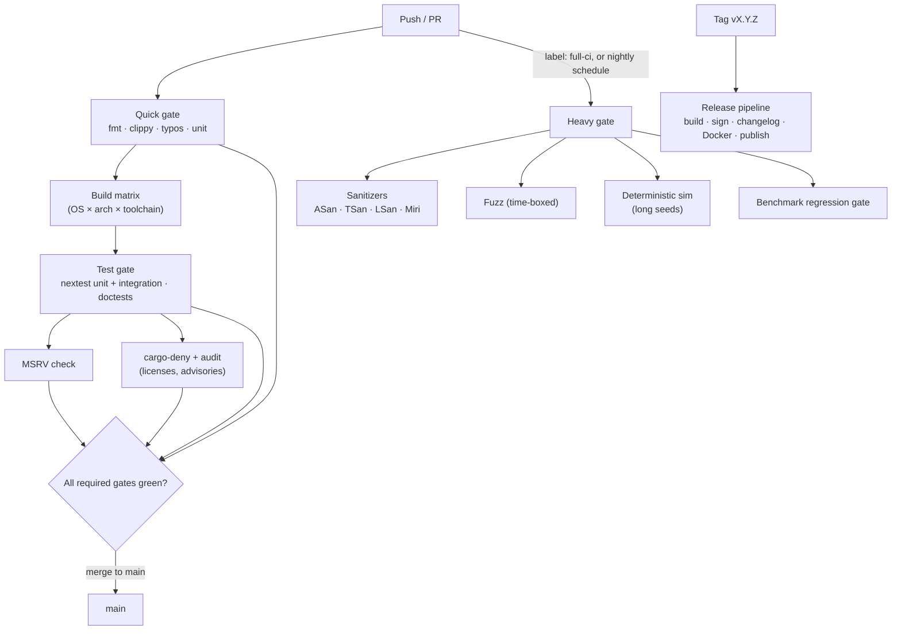
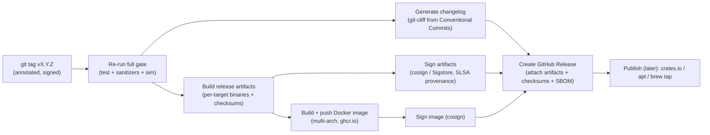
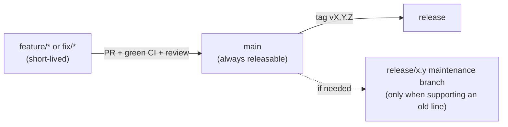

# 04 — CI/CD

> **Status:** Founding CI/CD plan. The YAML below is intent + a starting skeleton, not a guarantee of the current `.github/workflows`.
> **Read with:** [05 — Dev Environment](05-dev-environment.md) (the same toolchain, locally) · [06 — Testing Strategy](06-testing-strategy.md) (what the pipelines run) · [ADR-0005](adr/0005-reproducible-builds-pinned-toolchain.md) (reproducibility).

CI/CD runs on **GitHub Actions**. The pipeline's job is to make the [Charter's](00-charter.md) correctness posture *mechanical*: nothing merges that breaks a correctness oracle, regresses a benchmark, or fails a sanitizer. Because this is a no-deadline craft project, the gates are **strict by default** — we have time to be right.

## Principles

1. **Reproducible.** Toolchain pinned via `rust-toolchain.toml`; dependencies pinned via `Cargo.lock`; actions pinned by commit SHA. ([ADR-0005](adr/0005-reproducible-builds-pinned-toolchain.md))
2. **Fast feedback, deep safety.** Quick checks (fmt/clippy/unit) run on every push; expensive checks (sanitizers, fuzzing, long sim runs) run on a schedule or on labeled PRs, and as a merge gate where feasible.
3. **No silent regressions.** Benchmarks and the simulation suite have **do-not-regress gates** ([06](06-testing-strategy.md)).
4. **Releases are automated and signed.** Tag → built, tested, signed, published artifacts + Docker image + changelog. No manual release steps.

---

## Pipeline overview



---

## Required status checks (merge gate)

These **must** be green to merge into `main`:

| Check | Tool | Notes |
|---|---|---|
| **Format** | `cargo fmt --check` | Zero diffs. |
| **Lint** | `cargo clippy -- -D warnings` | Warnings are errors. |
| **Spelling** | `typos` | Cheap, catches doc/code typos. |
| **Unit + integration tests** | `cargo nextest run` | Across the OS/arch matrix (tier-1). |
| **Doctests** | `cargo test --doc` | nextest doesn't run doctests. |
| **MSRV** | build on the pinned minimum Rust | Guards against accidental version creep. |
| **Supply chain** | `cargo deny check` + `cargo audit` | Licenses, bans, security advisories. |
| **Docs build** | `cargo doc` (no warnings) | API docs must build clean. |

**Scheduled / labeled (deep) checks** — required for release branches, advisory on PRs unless `full-ci` label is applied:

| Check | Tool |
|---|---|
| **AddressSanitizer / ThreadSanitizer / LeakSanitizer** | nightly `-Zsanitizer=...` (UB checking is covered by Miri — `rustc` has no `-Zsanitizer=undefined`) |
| **Miri** (UB in unsafe code) | `cargo +nightly miri test` (core crates) |
| **Fuzzing** | `cargo fuzz` (time-boxed per target) |
| **Deterministic simulation** | `stele-sim` long-seed runs ([06](06-testing-strategy.md)) |
| **Benchmark regression** | `criterion` + a stored baseline gate |
| **Crash/recovery** | sim-driven kill-and-recover suites |
| **Cross-version reproducibility** | replay archived data + queries against the new build; assert **byte-identical** as-of results (release gate — [06 §10](06-testing-strategy.md#10-bitemporal-specific-test-additions-considerations-review)) |

---

## Driver gate (v0.2 exit criterion)

The `five-minute-path` job in `ci.yml` also runs the **driver gate** (STL-184):
real Postgres drivers connect to the freshly built Docker image and run a
**parameterized prepared query** end-to-end, proving the second half of the
[v0.2 exit criterion](03-roadmap.md) ("a JDBC/psycopg driver can run a
parameterized query"). Each driver creates a table, inserts through
placeholders, then executes a prepared `SELECT … WHERE id = ?` and asserts the
returned value.

| Driver | Version | Pin location | Notes |
|---|---|---|---|
| **psycopg** (Python 3) | `psycopg[binary] 3.3.4` | `ci.yml` (pip install) | `prepare=True` forces a named server-side prepared statement; small ints ride as binary `int2` params. Script: `ci/psycopg-smoke.py`. |
| **pgjdbc** (JDBC) | `org.postgresql:postgresql 42.7.7` | `ci/jdbc-smoke.sh` (jar + SHA-256) | The SELECT re-executes past `prepareThreshold` (5), exercising the named-statement promotion + binary result transfer. Script: `ci/JdbcSmoke.java`. |

This is deliberately **two drivers, one query shape** — the full driver/ORM
compatibility *matrix* is a v0.5 deliverable
([09 — ecosystem](09-ecosystem-and-products.md)). Both scripts also run against
a local dev server: `ci/psycopg-smoke.py localhost 5454` /
`ci/jdbc-smoke.sh localhost 5454`.

---

## Cross-platform matrix

| Tier | Targets | When |
|---|---|---|
| **Tier 1 (gating)** | `x86_64-unknown-linux-gnu`, `aarch64-apple-darwin` (macOS arm64) | Every PR |
| **Tier 2** | `aarch64-unknown-linux-gnu`, `x86_64-apple-darwin` | Nightly + release |
| **Tier 3 (best effort)** | `x86_64-pc-windows-msvc` | **Deferred** — not yet shipped (STL-160) |

Rationale in [assumption A6](assumptions.md): servers run Linux; contributors develop on macOS; Windows is built but not prioritized. Windows is currently **deferred**: the storage backend's positioned read uses the Unix-only `pread`, so the engine does not yet compile for `x86_64-pc-windows-msvc`. The portable `seek_read` path and a Windows CI leg land in STL-160, which restores the target to the release matrix.

---

## Workflow skeletons

> These are **starting points**. Pin every `uses:` to a commit SHA in the real files; the tags below are for readability.

### `ci.yml` — the quick + test gate (every PR)

```yaml
name: ci
on:
  pull_request:
  push:
    branches: [main]
concurrency:
  group: ci-${{ github.ref }}
  cancel-in-progress: true
env:
  CARGO_TERM_COLOR: always
  RUSTFLAGS: "-D warnings"
jobs:
  quick:
    runs-on: ubuntu-latest
    steps:
      - uses: actions/checkout@v4
      - uses: dtolnay/rust-toolchain@stable      # honors rust-toolchain.toml
        with: { components: rustfmt, clippy }
      - uses: Swatinem/rust-cache@v2
      - run: cargo fmt --all --check
      - run: cargo clippy --all-targets --all-features
      - uses: crate-ci/typos@master

  test:
    needs: quick
    strategy:
      fail-fast: false
      matrix:
        include:
          - { os: ubuntu-latest,  target: x86_64-unknown-linux-gnu }
          - { os: macos-latest,   target: aarch64-apple-darwin }
    runs-on: ${{ matrix.os }}
    steps:
      - uses: actions/checkout@v4
      - uses: dtolnay/rust-toolchain@stable
      - uses: Swatinem/rust-cache@v2
      - uses: taiki-e/install-action@nextest
      - run: cargo nextest run --all-features --workspace
      - run: cargo test --doc --all-features

  msrv:
    needs: quick
    runs-on: ubuntu-latest
    steps:
      - uses: actions/checkout@v4
      - uses: dtolnay/rust-toolchain@master
        with: { toolchain: "1.89.0" }            # pinned MSRV; bump deliberately
      - uses: Swatinem/rust-cache@v2
      - run: cargo build --workspace --all-features

  supply-chain:
    needs: quick
    runs-on: ubuntu-latest
    steps:
      - uses: actions/checkout@v4
      - uses: EmbarkStudios/cargo-deny-action@v2  # licenses, bans, advisories
      - uses: rustsec/audit-check@v2
        with: { token: ${{ secrets.GITHUB_TOKEN }} }
```

### `nightly.yml` — sanitizers, fuzzing, sim, benchmarks

```yaml
name: nightly
on:
  schedule: [{ cron: "0 6 * * *" }]
  pull_request:
    types: [labeled]                              # run when 'full-ci' is added
jobs:
  sanitizers:
    if: github.event_name == 'schedule' || contains(github.event.pull_request.labels.*.name, 'full-ci')
    runs-on: ubuntu-latest
    strategy:
      matrix: { san: [address, thread, leak] }
    steps:
      - uses: actions/checkout@v4
      - uses: dtolnay/rust-toolchain@nightly
        with: { components: rust-src }       # -Zbuild-std needs the std source
      - uses: Swatinem/rust-cache@v2
      - run: cargo nextest run -Zbuild-std --workspace   # rebuild std under the sanitizer ABI
        env:
          RUSTFLAGS: "-Zsanitizer=${{ matrix.san }}"
          RUSTDOCFLAGS: "-Zsanitizer=${{ matrix.san }}"
          CARGO_BUILD_TARGET: x86_64-unknown-linux-gnu

  miri:
    runs-on: ubuntu-latest
    steps:
      - uses: actions/checkout@v4
      - uses: dtolnay/rust-toolchain@nightly
        with: { components: miri }
      - run: cargo +nightly miri test -p stele-storage -p stele-common

  fuzz:
    runs-on: ubuntu-latest
    steps:
      - uses: actions/checkout@v4
      - uses: dtolnay/rust-toolchain@nightly
      - run: cargo install cargo-fuzz
      - run: |
          for t in $(cargo fuzz list); do
            cargo fuzz run "$t" -- -max_total_time=120
          done

  simulation:
    runs-on: ubuntu-latest
    steps:
      - uses: actions/checkout@v4
      - uses: dtolnay/rust-toolchain@stable
      - uses: Swatinem/rust-cache@v2
      - run: cargo run -p stele-sim --release -- --seeds 1000 --fault-injection on
      # failures print the seed; reproduce locally with --seed <N>

  bench-gate:
    runs-on: ubuntu-latest
    steps:
      - uses: actions/checkout@v4
      - uses: dtolnay/rust-toolchain@stable
      - uses: Swatinem/rust-cache@v2
      - run: cargo bench --workspace -- --save-baseline pr
      - run: ./ci/check-bench-regression.sh main pr   # fails if >X% slower
```

### Benchmark-regression gate (the do-not-regress rule)

The bench gate compares the PR's `criterion` results against a baseline stored for `main`. The rule ([06 §benchmarks](06-testing-strategy.md)):

- **Correctness benches** (as-of/bitemporal result-equivalence) must pass exactly — any change is a failure unless intentionally re-baselined in the same PR with justification.
- **Performance benches** fail the gate if a tracked metric regresses beyond a threshold (e.g., **>5%** wall-clock or **>3%** more allocations on a key path), unless the PR explicitly re-baselines with a written rationale.
- Baselines are versioned in the repo (or a benchmarks branch / `bencher`-style service) so regressions are traceable to a commit.

---

## Release automation

Tag-driven. Pushing an annotated tag `vX.Y.Z` triggers the release pipeline; **no manual steps.**



| Step | Tool | Notes |
|---|---|---|
| **Changelog** | `git-cliff` | Driven by **Conventional Commits**; keeps `CHANGELOG.md`. |
| **Version bump** | `cargo release` / `release-plz` | Optional automated PRs that bump versions + changelog. |
| **Artifacts** | `cargo build --release` per target | Static where feasible; SHA-256 checksums. |
| **Signing** | **cosign / Sigstore** + **SLSA provenance** | Keyless `cosign` signs SHA256SUMS and the image digest; `actions/attest-build-provenance` emits SLSA provenance for both (see below). |
| **SBOM** | `cargo cyclonedx` + `cyclonedx` (CycloneDX CLI) `merge` | Per-crate BOMs merged into one canonical workspace document `stele-<tag>.cdx.json`, attached to each release. |
| **Docker** | multi-arch `buildx` → **ghcr.io** | The canonical image ([05](05-dev-environment.md)); signed with cosign. |
| **Package registries** | crates.io (libraries), later Homebrew tap + apt/deb | pre-1.0: GitHub Releases + Docker only; registries follow as the API stabilizes. |

Example `release.yml` core:

```yaml
name: release
on:
  push:
    tags: ["v*.*.*"]
permissions:
  contents: write          # create releases
  packages: write          # push to ghcr
  id-token: write          # keyless cosign / SLSA
jobs:
  release:
    runs-on: ubuntu-latest
    steps:
      - uses: actions/checkout@v4
        with: { fetch-depth: 0 }
      - uses: dtolnay/rust-toolchain@stable
      - run: cargo nextest run --workspace        # gate before shipping
      - uses: orhun/git-cliff-action@v3           # changelog
        with: { args: --latest --strip header }
      - run: cargo build --release                # + matrix builds elsewhere
      - uses: sigstore/cosign-installer@v3
      - run: |                                     # sign checksums
          sha256sum target/release/stele > stele.sha256
          cosign sign-blob --yes stele.sha256 --output-signature stele.sig
      - uses: softprops/action-gh-release@v2
        with:
          files: |
            target/release/stele
            stele.sha256
            stele.sig
```

(Multi-arch binary builds and the Docker job run in parallel matrix jobs; condensed here.)

### SLSA build provenance

Beyond signing, the release attaches **SLSA build provenance** so a third party can verify *what built each artifact* (which workflow, which commit, which runner) — not just that we signed it. Both attestations come from [`actions/attest-build-provenance`](https://github.com/actions/attest-build-provenance), pinned by SHA like every other action ([ADR-0005](adr/0005-reproducible-builds-pinned-toolchain.md)):

- **Binaries** — the `release` job attests `SHA256SUMS` via `subject-checksums`, producing one provenance statement per archive (no re-hashing; it reuses the digests cosign already signed).
- **Image** — the `docker` job attests the pushed image by digest with `push-to-registry: true`. We deliberately use this over buildx `provenance: true`: buildx folds provenance into the image index, changing the manifest in ways some clients mishandle on multi-arch pulls, whereas attest-build-provenance stores a *separate* OCI artifact under the same digest, leaving `docker pull` untouched.

Both jobs add `attestations: write` to their (otherwise least-privilege) permissions. Verify a release:

```bash
# A downloaded binary archive (provenance is looked up by its digest)
gh attestation verify stele-vX.Y.Z-x86_64-unknown-linux-gnu.tar.gz --repo <owner>/stele

# The image (provenance travels with the digest in ghcr.io)
gh attestation verify oci://ghcr.io/<owner>/stele:vX.Y.Z --repo <owner>/stele
#   or, equivalently, with cosign:
cosign verify-attestation --type slsaprovenance \
  --certificate-identity-regexp '^https://github.com/<owner>/stele/' \
  --certificate-oidc-issuer https://token.actions.githubusercontent.com \
  ghcr.io/<owner>/stele@sha256:<digest>
```

---

## Branch strategy

**Trunk-based, with short-lived branches.** Simple, suited to a small (initially single-maintainer) project.



- **`main` is always releasable** and protected: required status checks, linear history (squash or rebase merges), signed commits encouraged.
- **Branches are short-lived** (`feature/*`, `fix/*`, `docs/*`); rebase before merge; squash-merge with a Conventional-Commit title.
- **Release branches** (`release/x.y`) are created **only if** an older line needs maintenance (unlikely pre-1.0).
- **No long-running divergent branches.** Big work lands behind feature flags or in `experimental/*` that never blocks `main`.
- **Conventional Commits** are required (enforced by a commit-lint check) because the changelog and version automation depend on them.

---

## Caching, cost, and flakiness

- **`Swatinem/rust-cache`** for incremental compile caching; **`sccache`** optionally for heavier matrices.
- **`cargo-nextest`** for faster, more reliable test runs and **flaky-test retries with quarantine** (a flaky test is a bug ticket, not an ignored failure).
- **Concurrency groups** cancel superseded runs to save minutes.
- **Self-hosted runners** are an option later for the long sim/fuzz jobs if GitHub-hosted minutes become a constraint.

---

## Reproducibility hooks (ties to [ADR-0005](adr/0005-reproducible-builds-pinned-toolchain.md))

- `rust-toolchain.toml` pins the exact compiler; CI never uses "whatever stable is today" except in an explicit `beta`/`nightly` early-warning job.
- `Cargo.lock` is committed and CI builds `--locked`.
- Actions pinned by SHA; a `dependabot`/`renovate` config proposes updates as reviewable PRs.
- Long-term goal: **bit-for-bit reproducible release artifacts** where the toolchain allows, so a third party can verify a published binary matches the tagged source.
