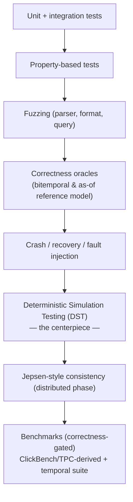
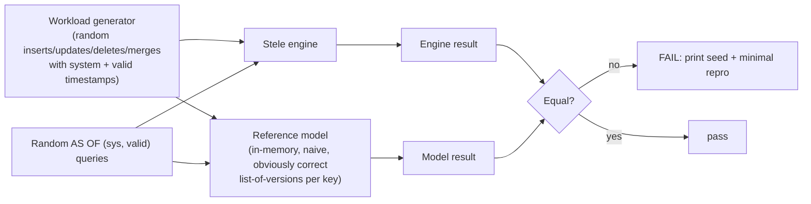
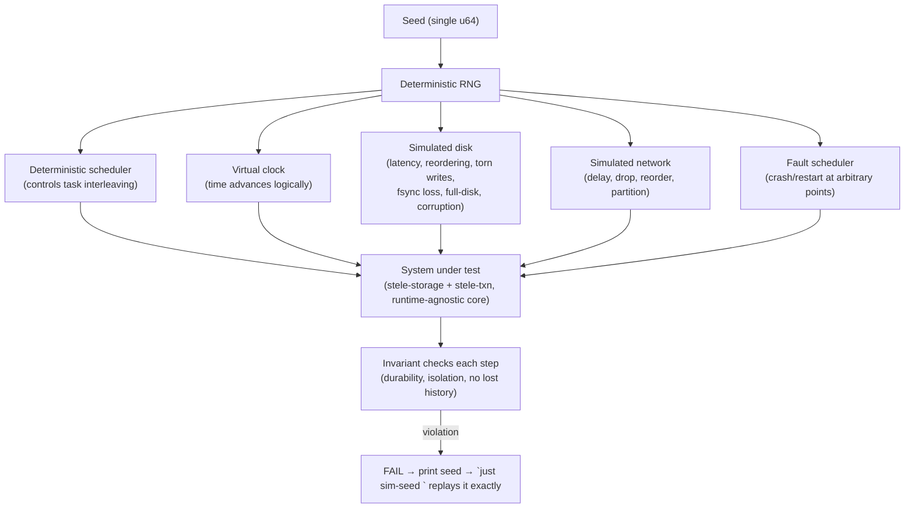

# 06 — Testing Strategy

> **Status:** Founding test philosophy. The *approach* is committed; the harness is built incrementally from v0.1.
> **Read with:** [00 — Charter §8 (the trust gate)](00-charter.md#8-the-trust-gate-no-production-data-stated-plainly) · [04 — CI/CD](04-cicd.md) (where these run) · [ADR-0010](adr/0010-deterministic-simulation-testing.md).

For a from-scratch database, **testing *is* the product.** The [Charter](00-charter.md) puts correctness and auditability above speed; this document is how that promise is mechanized. A benchmark number means nothing if the engine can silently corrupt history. So Stele invests, from day one, in the kinds of testing that catch the bugs ordinary unit tests never will.

## The testing pyramid (Stele's version)

Unlike the classic pyramid, **DST sits near the top as the centerpiece**, not as an afterthought — because the highest-value bugs in a database are emergent (concurrency, crash timing, fault interleavings), and DST is the only economical way to find them.

---

## 1. Unit & integration tests

The baseline. `cargo nextest` runs them fast and reliably ([04](04-cicd.md)).

- **Unit tests** live next to the code (`#[cfg(test)]`), cover pure logic: encoders/decoders, period arithmetic, planner rewrites, WAL record (de)serialization.
- **Integration tests** (`/tests`) exercise crate seams: write→flush→read round-trips, pg-wire request/response, end-to-end SQL.
- **Doctests** keep examples in the API docs honest (`cargo test --doc`).
- **Golden/snapshot tests** (`insta`) for plan output, `EXPLAIN`, error messages, and on-disk footer layouts — diffs are reviewed, not silently accepted.

---

## 2. Property-based testing

`proptest`/`quickcheck`-style generators assert **invariants over huge input spaces** instead of hand-picked cases. Examples:

- **Encode/decode round-trips:** for any column of any supported type with any codec, `decode(encode(x)) == x`.
- **Period algebra:** for any two half-open intervals, `overlaps`, `contains`, `meets`, `precedes` obey their algebraic laws (e.g., Allen's interval relations are mutually exclusive and exhaustive).
- **MERGE idempotence:** applying the same hash-keyed batch twice equals applying it once ([01 §A.5](01-feature-plan.md#a5--hash-keys--mergeupsert)).
- **Serialization:** any catalog/schema round-trips through its on-disk form.

Property tests **shrink** failing cases to a minimal reproducer automatically — the first line of defense for "I didn't think of that input."

---

## 3. Fuzzing

`cargo-fuzz` (libFuzzer) targets the surfaces most exposed to adversarial or malformed input:

| Target | What it hardens |
|---|---|
| **SQL parser fuzz** | No panic/UB on arbitrary query text; graceful errors. |
| **Segment-format fuzz** | A corrupt/hostile segment file is *detected*, never crashes or reads OOB (pairs with checksums, [02 §3.2](02-architecture.md#32-on-disk-segment-format)). |
| **pg-wire fuzz** | Malformed protocol messages can't crash the server. |
| **WAL-record fuzz** | Garbage WAL entries fail recovery cleanly, never corrupt state. |

Fuzzing runs time-boxed in nightly CI; any crash becomes a regression corpus entry so it can never recur. Coverage-guided, with a committed seed corpus.

---

## 4. Correctness oracles (the temporal heart)

This is where Stele's *identity* is protected. A correctness oracle is a **simple, obviously-correct reference implementation** that the real engine is checked against via **differential testing**.

- **The reference model** is a deliberately dumb, in-memory implementation of bitemporal semantics: every key maps to a list of `(sys_interval, valid_interval, value)` tuples; an `AS OF (s, v)` query is a linear scan. It is too slow for production and too simple to be wrong.
- **Differential test:** generate a random workload, apply it to *both* the engine and the model, then fire thousands of random `AS OF (sys, valid)` queries and assert **bitwise-equal results**.
- This catches the bugs that matter most: a compaction that drops a version, an off-by-one on a half-open interval, a MERGE that mis-closes a valid-time period, an as-of read that sees a version it shouldn't.
- **Oracles also exist for:** snapshot-isolation semantics (a reader never sees an uncommitted/newer version), provenance (every row's recorded `txn_id` matches the writing transaction), and MERGE historization (no gaps/overlaps in a key's valid-time timeline unless intended).

Every temporal behavior described in [02](02-architecture.md) has, or will have, an oracle. **No temporal feature is "done" without one.**

---

## 5. Deterministic Simulation Testing (DST) — the centerpiece

Stele adopts the **FoundationDB/TigerBeetle** approach: build the engine so that **all sources of non-determinism are injectable**, then run the entire system inside a simulator that controls time, disk, network, and randomness — so years of rare interleavings can be explored in minutes, and **any failure replays exactly from its seed.** ([ADR-0010](adr/0010-deterministic-simulation-testing.md))

### How it works

### What it buys us

- **Reproducibility:** a failure is a *number*. `just sim-seed 12345` replays the identical interleaving on any machine — no "works on my box," no heisenbugs.
- **Time compression:** controlling the clock lets the simulator explore thousands of crash-timing and message-ordering scenarios per second. (TigerBeetle's published figures: thousands of CPU-hours simulate *millennia* of runtime; a few seconds of simulation ≈ tens of minutes of real-world testing.)
- **Fault injection by construction:** crashes, torn writes, lost fsyncs, disk corruption, network partitions are *first-class inputs*, not flaky accidents.

### The architectural cost (paid deliberately)

DST requires the storage/txn core to be **deterministic and runtime-agnostic** — no direct clock reads, no ungoverned threads, no direct `std::fs`/`tokio::net` in the core. The `stele-sim` crate provides the virtual clock, RNG, disk, and network; the core depends on **traits**, with a real implementation for production and a simulated one for tests ([02 §11](02-architecture.md#11-crate--module-decomposition-intended), [assumption A13](assumptions.md)). This is the single biggest design constraint DST imposes, and it is accepted up front because retrofitting determinism later is enormously harder than building for it. This is exactly why TigerBeetle and FoundationDB were *designed* deterministic from line one.

### The invariant checker

At every simulated step, the harness asserts the [cross-cutting invariants](02-architecture.md#12-cross-cutting-architectural-invariants):

- **Durability:** anything acknowledged as committed survives any subsequent crash.
- **Isolation:** a snapshot reader never observes a write outside its snapshot.
- **No lost history:** the append-only invariant — a version that existed is still readable as-of its system interval after any compaction/crash/restart.
- **Recovery consistency:** post-recovery state equals some valid serial history.

---

## 6. Crash & recovery testing

A specialization of DST plus standalone tests:

- **Kill-at-every-step:** crash the engine at each WAL/flush boundary and assert recovery to a consistent state ([02 §3.6](02-architecture.md#36-crash-recovery)).
- **Torn-write & lost-fsync models:** the simulated disk drops or partially writes pages to model real power-loss; recovery must still be correct or cleanly detect corruption.
- **Idempotent replay:** replaying the WAL twice equals replaying once.
- **Backup/restore round-trip:** restore equals source, including full history and provenance ([01 §B.6](01-feature-plan.md#b6--backup-restore--snapshots)).

---

## 7. Jepsen-style consistency testing (distributed phase)

Gated to the distribution era ([03](03-roadmap.md#v20--distribution-era)) but planned now so the system is built to survive it:

- **[Jepsen](https://jepsen.io/)-style** black-box testing: drive a real multi-node cluster with concurrent clients while injecting partitions, clock skew, and node failures, then check histories against a consistency model (e.g., with Elle for transactional anomalies).
- **The rule (Charter §8):** *no multi-node production claim before Jepsen-style testing is in place and passing.* Consistency is asserted under partition, not assumed.
- DST and Jepsen are complementary: DST is white-box and exhaustive-ish on the simulated single binary; Jepsen is black-box on the real distributed deployment.

---

## 8. Benchmark suite (correctness-first, asymmetric)

Benchmarks exist to **prevent regressions and prove the asymmetric performance contract** — never to chase the dual-graveyard goal ([Charter §3](00-charter.md#3-the-guardrail--lead-with-the-non-goal)).

| Suite | What it measures | Bar |
|---|---|---|
| **Temporal/as-of suite** (bespoke) | as-of point/range, bitemporal joins, MERGE historization throughput, time-range pruning effectiveness | **World-class** — this is the identity |
| **Analytical** (ClickBench-, TPC-H-derived) | scan, filter, aggregate, join throughput | **World-class / competitive** |
| **Transactional** (TPC-C-like point ops) | single-row upsert/lookup latency | **Adequate floor** — must not be embarrassing; not a win target |
| **Ingest** | bulk load + MERGE rates | Competitive (it's an audit/historization engine) |
| **Recovery/compaction** | recovery time, compaction throughput, write amplification | Tracked for regressions |

**Correctness gates every benchmark:** a benchmark run first asserts the result is *correct* (against an oracle or known answer); a fast wrong answer fails. We will never publish a number bought with a correctness compromise.

### The do-not-regress gate

`criterion` benchmarks produce a baseline stored per `main` commit. In CI ([04 §benchmark-regression](04-cicd.md#benchmark-regression-gate-the-do-not-regress-rule)):

- **Performance regressions** beyond a threshold (e.g., **>5%** on a tracked path) **fail the PR** unless explicitly re-baselined with a written rationale in the same PR.
- **Correctness benches** must pass exactly.
- Baselines are versioned and traceable to a commit, so any regression points at the change that caused it.

> The point of the gate is not to chase ever-higher numbers — it's to ensure we never *quietly get slower* (or wronger) while working on something else. On a slow-churn project, that quiet erosion is the real risk.

---

## 9. What "tested enough to hold real data" means (the trust gate, operationalized)

The [Charter's trust gate](00-charter.md#8-the-trust-gate-no-production-data-stated-plainly) becomes this concrete, CI-visible checklist. **All green = production data becomes permissible (at v1.0):**

- [ ] DST runs continuously in CI with fault injection; failures are seed-reproducible and triaged to zero.
- [ ] Bitemporal & as-of correctness oracles pass over a large generated corpus (millions of operations).
- [ ] Crash/recovery: kill-at-every-step and torn-write/lost-fsync suites pass.
- [ ] Backup/restore + PITR round-trip proven by test, including full history + provenance.
- [ ] Snapshot-isolation and provenance oracles pass.
- [ ] Fuzz targets run clean over sustained nightly time; corpus committed.
- [ ] Sanitizers (ASan/TSan/UBSan) + Miri clean on core crates.
- [ ] A real (even small) OSS user base has exercised the engine on non-critical data.
- [ ] **(Distributed only)** Jepsen-style testing in place and passing before any multi-node production claim.

Until every box is checked, Stele runs **synthetic and contributor data only.** That is the line, and it is enforced by this document, not by judgment in the moment.

---

## Tooling summary

| Layer | Tool(s) |
|---|---|
| Test runner | `cargo-nextest` (+ `cargo test --doc`) |
| Property tests | `proptest` |
| Snapshot/golden | `insta` |
| Fuzzing | `cargo-fuzz` (libFuzzer) |
| Simulation (DST) | bespoke `stele-sim` crate (virtual clock/disk/net + deterministic scheduler + VOPR-style seed replay) |
| Sanitizers | nightly `-Zsanitizer=address,thread,undefined`; `miri` |
| Consistency (dist.) | Jepsen + Elle (later phase) |
| Benchmarks | `criterion` (+ ClickBench/TPC-derived harnesses), do-not-regress gate |
| Supply chain | `cargo-deny`, `cargo-audit` |
