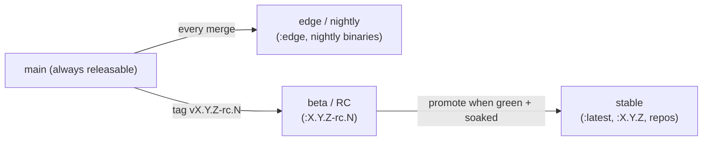
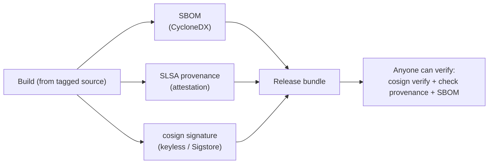

# 08 — Packaging, Distribution & Releases

> **Status:** Founding distribution plan. Nothing here is built this session; it defines *what we ship, how it's versioned, and how it's distributed* so the engineering doesn't have to reverse-engineer it later.
> **Read with:** [04 — CI/CD](04-cicd.md) (the *pipeline* that produces these) · [09 — Ecosystem & Products](09-ecosystem-and-products.md) (the downstream products) · [ADR-0014](adr/0014-release-channels-and-versioning-policy.md) (versioning/compat) · [ADR-0005](adr/0005-reproducible-builds-pinned-toolchain.md) (reproducibility).

[04 — CI/CD](04-cicd.md) describes the *pipeline*. This document is the **product/release-management** view: the full catalog of shipped artifacts, the registries and channels they flow through, the **cross-artifact versioning and compatibility policy**, and the supply-chain guarantees that wrap all of it. Everything Stele ships is **signed, versioned, and reproducible** ([ADR-0005](adr/0005-reproducible-builds-pinned-toolchain.md)).

> A note on phasing: artifacts land across milestones ([roadmap §artifact roadmap](03-roadmap.md#artifact--product-roadmap)). "Later" never means "unplanned" — every artifact below has a home in the sequence.

## 1. The artifact catalog

Everything Stele publishes, in one table. Each row links to its detail section.

| Artifact | Form | Primary channel | License | Lands |
|---|---|---|---|---|
| **Engine server** (`stele-server`) | Static-ish binary per target | GitHub Releases + registries | BSL 1.1 | v0.1 |
| **CLI / REPL** (`stele`) | Binary (bundled + standalone) | GitHub Releases + Homebrew/apt/… | BSL 1.1 | v0.1 |
| **Docker images** | Multi-arch OCI images, tagged | `ghcr.io` (+ Docker Hub mirror) | BSL 1.1 | v0.1 |
| **Client SDK** (`stele-client`) | Rust crate + thin language SDKs | crates.io / language registries | BSL 1.1 | v0.3 |
| **Helm chart** | OCI Helm chart | Helm repo / `ghcr.io` | BSL 1.1 | v0.5 |
| **Kubernetes/OpenShift operator** | OLM bundle + images | OperatorHub / Red Hat Catalog | BSL 1.1 | v0.7 |
| **Desktop app** ("Stele Studio") | Signed installers (mac/win/linux) | GitHub Releases + Homebrew Cask/winget | BSL 1.1 | v0.7 |
| **Docs site** | Per-release versioned static site | `docs.steledb.com` | docs license | v0.3 |
| **Marketing site + playground** | Static site + WASM demo | `steledb.com` | n/a | v0.3 |
| **Cloud marketplace images** | AMI / GCP / Azure images | Cloud marketplaces | BSL 1.1 | v2.0+ |

Detail on the *products* (desktop app, operator, SDKs, sites, playground) lives in [09](09-ecosystem-and-products.md); this doc covers how **all** of them are tagged, versioned, signed, and distributed.

## 2. Tagged Docker images

The container image is the canonical "run Stele without a toolchain" path ([05](05-dev-environment.md#the-canonical-docker-image)).

**Registries:** `ghcr.io/fricker-studios/stele` is canonical; Docker Hub ([`frickerstudios/stele`](https://hub.docker.com/r/frickerstudios/stele) — Hub namespaces can't carry the hyphen) is a mirror. Both receive identical, signed, multi-arch (`linux/amd64`, `linux/arm64`) images from the same buildx push, so digests match across registries. The Hub landing page is `docker/README.md`, re-synced by the release pipeline on every tag.

**Image variants:**

| Variant | Base | Purpose |
|---|---|---|
| `stele` (default) | distroless/cc | Production runtime — minimal, no shell. |
| `stele:*-debug` | debian-slim | Same binary + a shell and tools for troubleshooting. |
| `stele:*-demo` | debian-slim | All-in-one: engine + sample data + MinIO wiring for the five-minute demo. |

**Tag scheme** (immutable digests are the source of truth; tags are convenience pointers):

```
ghcr.io/<org>/stele:1.4.2        # exact version (immutable once published)
ghcr.io/<org>/stele:1.4          # latest patch of 1.4.x (moves)
ghcr.io/<org>/stele:1            # latest minor of 1.x (moves)
ghcr.io/<org>/stele:latest       # latest stable release (moves)
ghcr.io/<org>/stele:edge         # latest nightly/main build (moves)
ghcr.io/<org>/stele:1.5.0-rc.1   # pre-release / beta channel
ghcr.io/<org>/stele@sha256:…     # pin by digest (recommended for prod)
```

Every image is **signed with cosign** and ships an attached **SBOM** and **SLSA provenance** (§9). Pre-1.0, `latest` may move across breaking changes — the [version policy](#7-versioning--compatibility-policy-the-important-part) says so explicitly.

## 3. Binaries

Standalone binaries for users who don't want containers.

- **Target matrix** mirrors the [CI tiers](04-cicd.md#cross-platform-matrix): tier-1 `x86_64-unknown-linux-gnu`, `aarch64-apple-darwin`; tier-2 `aarch64-unknown-linux-gnu`, `x86_64-apple-darwin`; tier-3 `x86_64-pc-windows-msvc` (best effort — the storage backend's positioned read is platform-split `pread`/`seek_read`, and a per-PR CI job builds the workspace + runs the storage suite on Windows; STL-160).
- **Naming:** `stele-<version>-<platform>.<ext>` (e.g. `stele-1.4.2-aarch64-apple-darwin.tar.gz`, `stele-1.4.2-x86_64-linux.tar.gz`), each with a `.sha256` and a cosign `.sig`. `<platform>` is the Rust target triple, except the Linux targets are shortened to `<arch>-linux` (dropping the `-unknown-…-gnu`) — only one Linux build ships per architecture, so the extra qualifiers are redundant noise for users (STL-262).
- **Linking:** statically linked where the target allows (musl on Linux) so there are no runtime dependencies.
- **Contents:** each archive bundles both `stele-server` and the `stele` CLI, plus shell completions and man pages.
- **Self-update:** `stele self update` checks the release feed, verifies the signature, and swaps the binary in place (can be disabled for managed installs).

## 4. CLI / REPL distribution

The `stele` CLI ([05 §the-stele-cli](05-dev-environment.md#the-stele-cli)) ships two ways: **bundled** with every server artifact, and **standalone** for client-only use (a laptop talking to a remote engine).

- **One-line install:** `curl -fsSL https://steledb.com/install.sh | sh` (verifies signature; respects `STELE_VERSION`).
- **Shell completions** (bash/zsh/fish/powershell) and **man pages** generated at build time and packaged.
- **REPL niceties:** history, multiline editing, `\dt`/`\d`-style introspection, and Stele's temporal helpers (e.g. `\asof <ts>`), all over pg-wire so the CLI doubles as a reference client.

## 5. Package registries & install channels

The goal: every platform has a *native* install path, not just "download a tarball."

| Channel | Artifact(s) | Notes |
|---|---|---|
| **Homebrew tap** (`steledb/tap`) | CLI, server, desktop app (Cask) | macOS + Linuxbrew. |
| **apt / deb repo** | server, CLI | Debian/Ubuntu; signed repo. |
| **rpm / dnf repo** | server, CLI | Fedora/RHEL; signed repo. |
| **winget + Scoop** | CLI, desktop app | Windows. |
| **crates.io** | `stele-client` (+ libraries) | Rust SDK and reusable crates only — not the server. |
| **Helm repo** (OCI) | Helm chart | `helm install` path ([09 §operator](09-ecosystem-and-products.md#5-kubernetes--openshift-operator)). |
| **OperatorHub / Red Hat Catalog** | operator (OLM bundle) | Certified OpenShift listing ([ADR-0013](adr/0013-kubernetes-openshift-operator.md)). |
| **Container registries** | images | `ghcr.io` canonical + Docker Hub mirror (`frickerstudios/stele`). |
| **GitHub Releases** | everything (source of truth) | Signed artifacts, checksums, SBOM, changelog. |
| **Cloud marketplaces** | VM images | Later ([09 §8](09-ecosystem-and-products.md#8-cloud-marketplace-images)). |

Pre-1.0, GitHub Releases + container registries are the only *guaranteed* channels; the OS package repos and Homebrew come online around v0.3–v0.5 as the CLI/server stabilize.

## 6. Release channels & cadence

Three channels; **no calendar cadence** (this is a no-deadline track — [03](03-roadmap.md)) but clear channel semantics:



- **edge / nightly** — built from `main` on every merge; for contributors and the brave. No stability promise.
- **beta / RC** — a tagged release candidate; gets the full deep CI gate ([04](04-cicd.md#nightlyyml--sanitizers-fuzzing-sim-benchmarks)) and a soak period; the place breaking changes are surfaced before stable.
- **stable** — promoted from a soaked RC; this is what `latest`, the version tags, and the OS package repos point at.

A release is **tag-driven** ([04 §release-automation](04-cicd.md#release-automation)): pushing `vX.Y.Z` runs the full gate, builds every artifact in the catalog, signs them, generates the changelog, and publishes to all channels in one automated flow.

## 7. Versioning & compatibility policy (the important part)

Stele ships *many* artifacts that evolve at different rates. They share a **coordinated SemVer** discipline but version **independently**, with explicit compatibility contracts. This is the policy most likely to save (or sink) us later, so it's pinned in [ADR-0014](adr/0014-release-channels-and-versioning-policy.md).

| Versioned surface | Scheme | Compatibility contract |
|---|---|---|
| **Engine / server** | SemVer `X.Y.Z` | Pre-1.0: minors may break. From 1.0: no breaking changes without a major. |
| **On-disk format** | Integer `format vN` | **Forward-compatible from v1.0**: a newer engine always reads older `format vN`; migrations are explicit and tested. Pre-1.0 it may break (with a documented migration each time). |
| **Wire protocol** | pg-wire subset, documented per release | Adds capabilities over time; never silently drops a supported message. |
| **Client SDK** (`stele-client`) | SemVer, tracks engine minor | An SDK works against its own engine minor and one minor back. |
| **Admin/control API** | API version (`v1alpha1`→`v1beta1`→`v1`) | Kube-style graduation; deprecation window before removal ([ADR-0016](adr/0016-admin-control-plane-api.md)). |
| **Operator CRDs** | CRD `vNalphaM` … `vN` | Conversion webhooks across CRD versions; never break a stored resource ([ADR-0013](adr/0013-kubernetes-openshift-operator.md)). |
| **Helm chart** | Chart SemVer, `appVersion` = engine | Chart majors track breaking value/topology changes. |
| **Desktop app** | SemVer, tracks engine minor | Connects to its engine minor ± one; degrades gracefully against others. |
| **Docs** | One versioned set per engine minor | `docs.steledb.com` version switcher (§10). |

**Cross-cutting rules:**
- **The on-disk format is the most conservative surface** — once real data exists (post-1.0), it is forward-compatible forever. Everything else can move faster.
- **MSRV** is a documented floor, bumped deliberately ([ADR-0005](adr/0005-reproducible-builds-pinned-toolchain.md)).
- **Deprecation policy** (from 1.0): anything deprecated keeps working for at least one minor with a warning before removal; removals only at a major.
- **LTS:** not promised pre-1.0; revisited at 1.0 if adopters need long-support lines.
- **A compatibility matrix** (engine ↔ SDK ↔ operator ↔ app ↔ format) is published with each release so operators can see what works with what.

## 8. Reproducibility

All of the above rests on [ADR-0005](adr/0005-reproducible-builds-pinned-toolchain.md): pinned toolchain (`rust-toolchain.toml`), committed `Cargo.lock` built `--locked`, SHA-pinned Actions, and a long-term goal of **bit-for-bit reproducible release artifacts** so a third party can independently rebuild a published binary from the tagged source and get the same bytes.

## 9. Supply-chain & artifact integrity

Every published artifact — binary, image, chart, installer, SDK — carries the same guarantees:



- **Signing:** cosign keyless (Sigstore) for images, binaries, charts, and installers.
- **SBOM:** CycloneDX, generated by `cargo cyclonedx`, attached to each release.
- **Provenance:** SLSA build provenance attestation, so the artifact traces to the exact commit + workflow.
- **Verification is documented:** the docs site shows the exact `cosign verify` / checksum commands so users can prove what they downloaded.
- **Dependency hygiene:** `cargo-deny` + `cargo-audit` gate every build ([04](04-cicd.md#required-status-checks-merge-gate)); only redistribution-compatible licenses ship ([07](07-licensing-and-oss.md#repository-licensing-hygiene)).

## 10. Docs per release

Documentation is **versioned alongside the engine**: each engine minor gets its own published doc set, selectable via a version switcher on `docs.steledb.com`. The in-repo `/docs` (this set) is the source of truth and is built into the site at release time. The site itself (generator, hosting, search, the marketing front end, and the WASM playground) is detailed in [09 §docs-and-marketing-site](09-ecosystem-and-products.md#6-docs--marketing-site). Cross-reference: the docs-site/community plan in [07](07-licensing-and-oss.md#documentation--site-plan).

## 11. Auto-update & upgrades

| Artifact | Update mechanism |
|---|---|
| **CLI / binaries** | `stele self update` (signature-verified); can be disabled for managed installs. |
| **Docker images** | Standard registry pull of a new tag/digest. |
| **Desktop app** | Tauri auto-updater (signed update feed); user-controllable ([09 §desktop](09-ecosystem-and-products.md#4-desktop-analytics-app-stele-studio)). |
| **Helm/operator** | The operator performs **format-compatibility-aware rolling upgrades** of the engine; Helm upgrades for chart-managed installs ([09 §operator](09-ecosystem-and-products.md#5-kubernetes--openshift-operator)). |

All update channels verify signatures before applying, and respect the [compatibility policy](#7-versioning--compatibility-policy-the-important-part) — an upgrade never silently crosses an incompatible on-disk-format boundary.

---

*Decisions behind this doc: release channels & versioning ([ADR-0014](adr/0014-release-channels-and-versioning-policy.md)), reproducibility ([ADR-0005](adr/0005-reproducible-builds-pinned-toolchain.md)). The products distributed here are detailed in [09](09-ecosystem-and-products.md).*
