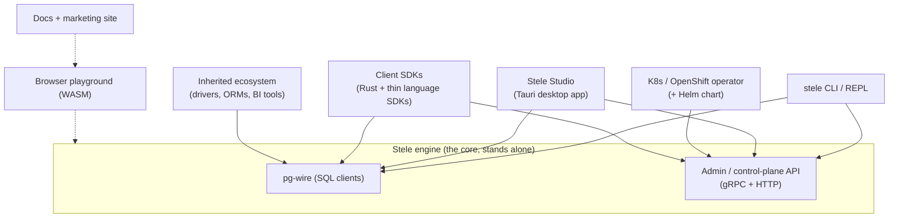
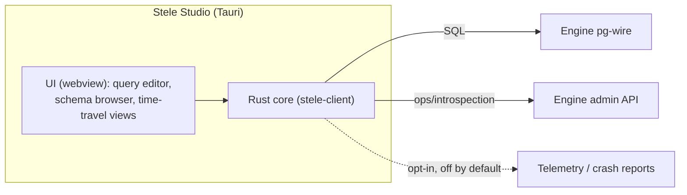
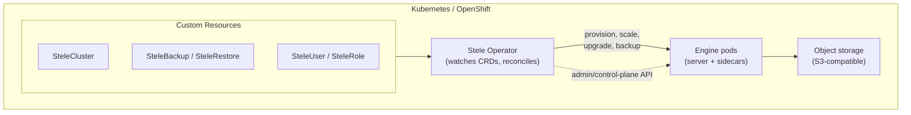

# 09 — Ecosystem & Products

> **Status:** Founding plan for the products *around* the engine. Nothing built this session.
> **Read with:** [08 — Packaging & Distribution](08-packaging-distribution-and-releases.md) (how these ship) · [02 — Architecture](02-architecture.md) (the engine they sit on) · ADRs [0012](adr/0012-desktop-app-tauri.md) (desktop), [0013](adr/0013-kubernetes-openshift-operator.md) (operator), [0015](adr/0015-telemetry-opt-in.md) (telemetry), [0016](adr/0016-admin-control-plane-api.md) (admin API).

These are the products and surfaces built **on top of** the engine. The discipline mirrors the [Solvia seam](00-charter.md#7-the-solvia-seam-designed-for-decoupled): **the engine stands alone** — every product here is optional, decoupled, and additive. None of them is allowed to become load-bearing for the engine's correctness.

The split: **SQL goes over pg-wire** (inheriting the whole driver/ORM/BI ecosystem, [ADR-0003](adr/0003-postgres-wire-protocol-early.md)); **operations go over a dedicated admin/control-plane API** ([ADR-0016](adr/0016-admin-control-plane-api.md)) that both the desktop app and the operator depend on.

## 1. The `stele` CLI / REPL

Detailed as a dev tool in [05](05-dev-environment.md#the-stele-cli) and as a shipped artifact in [08 §4](08-packaging-distribution-and-releases.md#4-cli--repl-distribution). As a *product* it is: the primary admin surface for scripts and CI, an interactive SQL/temporal REPL, and the reference pg-wire client. It is the lowest-friction way to touch Stele and ships from **v0.1**.

## 2. The admin / control-plane API (the shared substrate)

Both Stele Studio and the operator need more than SQL — health, metrics, backup/restore, segment inspection, user/role management, and (later) cluster lifecycle. Rather than overload pg-wire, Stele exposes a **dedicated admin/control-plane API** ([ADR-0016](adr/0016-admin-control-plane-api.md)):

- **Transport:** gRPC (typed, for programmatic clients and the operator) with an HTTP/JSON gateway (for the desktop app, scripts, and curl).
- **Surface:** lifecycle (status, config), data ops (backup, restore, PITR, snapshot), introspection (catalog, segments, zone maps, lineage), security (users, roles, grants), and observability (metrics, slow queries, EXPLAIN).
- **Versioned** `v1alpha1`→`v1beta1`→`v1`, Kubernetes-style, with deprecation windows ([08 §7](08-packaging-distribution-and-releases.md#7-versioning--compatibility-policy-the-important-part)).
- **Auth:** the same identities/RBAC as the SQL surface; TLS required.

This API is the **single seam** the products integrate against — it keeps the engine's surface clean and lets the CLI, app, operator, and SDKs share one contract.

## 3. Client SDKs

- **SQL access needs no first-party SDK** — users use existing Postgres drivers (psycopg, pgx, JDBC, …) thanks to pg-wire. We maintain a *compatibility matrix*, not a driver ([01 §B.11](01-feature-plan.md#b11--client-interface--ecosystem)).
- **`stele-client` (Rust)** wraps the admin/control-plane API and the temporal niceties; it's published to crates.io and is what the CLI, Studio, and operator build on.
- **Thin language SDKs** (Python, TypeScript, Go) wrap the admin API's HTTP/gRPC surface for automation; added as demand appears (v1.0+). They are convenience wrappers, not reimplementations.

## 4. Desktop analytics app ("Stele Studio")

A standalone, **pgAdmin-style desktop application** — and the future home of the analytics workflow. Built with **Tauri** (Rust core + native webview), so it shares the `stele-client` crate and types with the engine, ships tiny signed binaries, and feels native ([ADR-0012](adr/0012-desktop-app-tauri.md)). Licensed **BSL 1.1**, free, source-available — a community tool that drives adoption, with monetization living in the cloud/operator/enterprise tiers, not here.

**Phase 1 — admin & query tool (v0.7 preview → v1.0):**
- Connection manager; schema/catalog browser; SQL editor with completion and history.
- **Temporal-native UI** — the differentiator a generic pg tool can't offer: an `AS OF` time-slider, side-by-side "what we believed then vs now" diffs, valid-time vs system-time views, and a **lineage/provenance explorer** for any row.
- Segment/zone-map inspector and `EXPLAIN ANALYZE` visualizer for debugging.
- Backup/restore and PITR via the admin API.

**Phase 2 — analytics workflow (post-1.0):**
- Saved queries, parameterized dashboards, charts over result sets, scheduled/temporal reports, and export — the "analytics workflow" this app is meant to grow into.

**Cross-platform & integrity:**
- Targets macOS (universal), Windows, Linux (AppImage/deb/rpm).
- **OS code-signing + notarization** (Apple notarization, Windows Authenticode), distributed via GitHub Releases, Homebrew Cask, and winget ([08 §5](08-packaging-distribution-and-releases.md#5-package-registries--install-channels)).
- **Tauri auto-updater** against a signed update feed ([08 §11](08-packaging-distribution-and-releases.md#11-auto-update--upgrades)).
- **Opt-in, off-by-default** telemetry and crash reporting ([§9](#9-telemetry--privacy), [ADR-0015](adr/0015-telemetry-opt-in.md)).

> Naming: "Stele Studio" is the working name; the trademark/brand check ([07 §trademark](07-licensing-and-oss.md#trademark-notes)) applies before any public use.

## 5. Kubernetes / OpenShift operator

The supported way to run Stele on Kubernetes and OpenShift. We ship **both** a Helm chart (the simple path) and a full **operator** (lifecycle automation), target **OperatorHub**, and pursue **Red Hat OpenShift certification** ([ADR-0013](adr/0013-kubernetes-openshift-operator.md)).

- **CRDs:** `SteleCluster` (topology, storage backend, resources), `SteleBackup`/`SteleRestore` (scheduled + on-demand, to object storage), `SteleUser`/`SteleRole` (declarative auth). CRD versions graduate `v1alpha1`→`v1`, with conversion webhooks so a stored resource never breaks ([08 §7](08-packaging-distribution-and-releases.md#7-versioning--compatibility-policy-the-important-part)).
- **Lifecycle:** provisioning, configuration, scaling compute (especially clean once [storage/compute are separated](adr/0007-storage-compute-separation.md)), **format-compatibility-aware rolling upgrades**, backup/restore/PITR, and (in the distributed era) failover.
- **Clock-sync preflight:** for distributed clusters the operator **requires and continuously monitors NTP/PTP** on every node (the engine is time-native) and surfaces skew alerts — a node without healthy time sync is not admitted ([ADR-0022](adr/0022-clock-synchronization-and-ordering.md)).
- **Packaging:** OLM bundle on **OperatorHub**; Helm chart in an OCI Helm repo; images from `ghcr.io`. Pursue OpenShift **certified** status and climb the operator **capability levels** (Basic Install → Seamless Upgrades → Full Lifecycle → Deep Insights → Autopilot) as the engine matures.
- **Phasing:** Helm chart at **v0.5**, operator at **v0.7**, OpenShift certification around **v1.0**, distributed-cluster management at **v2.0+** ([roadmap](03-roadmap.md#artifact--product-roadmap)).

## 6. Docs & marketing site

Two surfaces, one brand at `steledb.com` ([07 §docs-site](07-licensing-and-oss.md#documentation--site-plan)):

- **Marketing site** (`steledb.com`): the one-paragraph thesis, the [four-statement identity demo](README.md#the-thesis-in-four-sql-statements), an honest status banner (pre-1.0, no production data yet — [trust gate](06-testing-strategy.md#9-what-tested-enough-to-hold-real-data-means-the-trust-gate-operationalized)), a download/install page, and a blog/changelog.
- **Docs site** (`docs.steledb.com`): **per-release versioned** documentation built from in-repo `/docs`, with a version switcher and search. Generator: **Docusaurus** (first-class versioning + blog + search) is the likely choice over mdBook once per-release versioning matters; revisit at v0.3 when the site comes online ([08 §10](08-packaging-distribution-and-releases.md#10-docs-per-release)).
- **API/SQL reference** generated where possible (from the SQL grammar and the admin API's protobuf/OpenAPI), so reference docs can't drift from the implementation.

## 7. Browser playground (WASM)

A **"try Stele in your browser"** demo: a subset of the engine compiled to **WebAssembly** running entirely client-side (the [DST-friendly, runtime-agnostic core](adr/0010-deterministic-simulation-testing.md) helps here), powering an interactive console on the marketing site. Users run the temporal/as-of demo without installing anything — the single best top-of-funnel for a systems project, in the spirit of TigerBeetle's in-browser demo. Targeted alongside the site (v0.3+), deepened over time.

## 8. Cloud marketplace images

For teams that deploy on VMs rather than Kubernetes, Stele ships prebuilt **cloud marketplace images** — AMIs (AWS) and GCP/Azure machine images — with the engine, CLI, and sane defaults preinstalled, plus (later) listings on the **AWS / GCP / Azure marketplaces**. The operator/Helm path ([§5](#5-kubernetes--openshift-operator)) covers Kubernetes; marketplace images cover the VM path; both pull the same signed binaries ([08](08-packaging-distribution-and-releases.md)). This is a **v2.0+** surface, tied to the [managed/cloud offering](03-roadmap.md#v20--distribution-era) — self-hosted first, marketplace convenience later.

## 9. Telemetry & privacy

**Off by default; explicit opt-in** across every artifact — engine, CLI, desktop app ([ADR-0015](adr/0015-telemetry-opt-in.md)). This is a deliberate expression of the project's trust-first, audit-native ethos and a feature for regulated adopters.

- **Default:** nothing leaves the user's machine. No phone-home, no silent beacons.
- **If a user opts in:** strictly **anonymous aggregate** signal — version, OS/arch, feature-usage counters, anonymized crash reports. **Never** query text, schema, data, identifiers, or connection details.
- **Transparent:** what would be collected is documented in the docs site and printed on opt-in; the collection code is in the open (BSL source-available).
- **Revocable:** opt-out at any time, single flag/setting.

## 10. How the pieces fit (recap)

| Surface | Talks to engine via | Audience |
|---|---|---|
| Existing PG drivers / ORMs / BI tools | pg-wire | Everyone (inherited free) |
| `stele` CLI / REPL | pg-wire + admin API | Operators, scripts, CI |
| `stele-client` + thin SDKs | pg-wire + admin API | Automation/integrators |
| Stele Studio (desktop) | pg-wire + admin API | Analysts, DBAs |
| Operator / Helm | admin API + K8s | Platform teams |
| Browser playground | embedded WASM core | Evaluators, learners |

Every one of these is decoupled and optional; remove all of them and the engine still runs, still passes its [oracles and sim suite](06-testing-strategy.md), and still holds its [charter guarantees](00-charter.md). That is the invariant.

---

*Distribution mechanics for all of the above are in [08](08-packaging-distribution-and-releases.md). Where each lands in the sequence is in the [artifact/product roadmap](03-roadmap.md#artifact--product-roadmap).*
