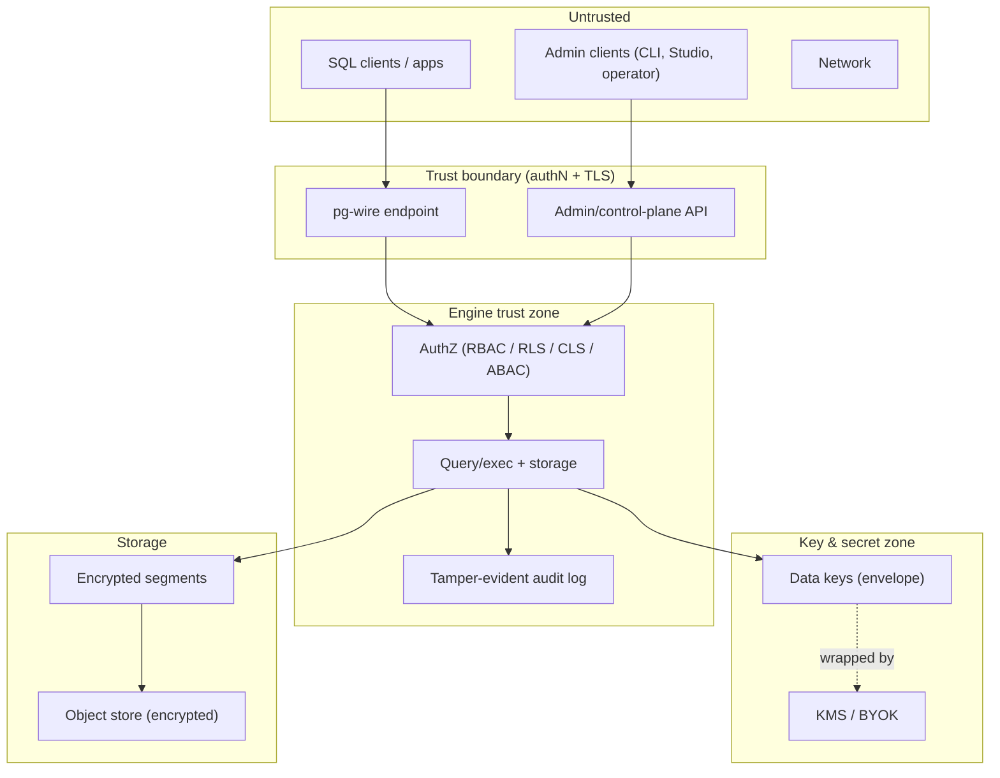
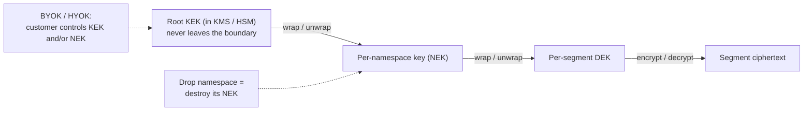
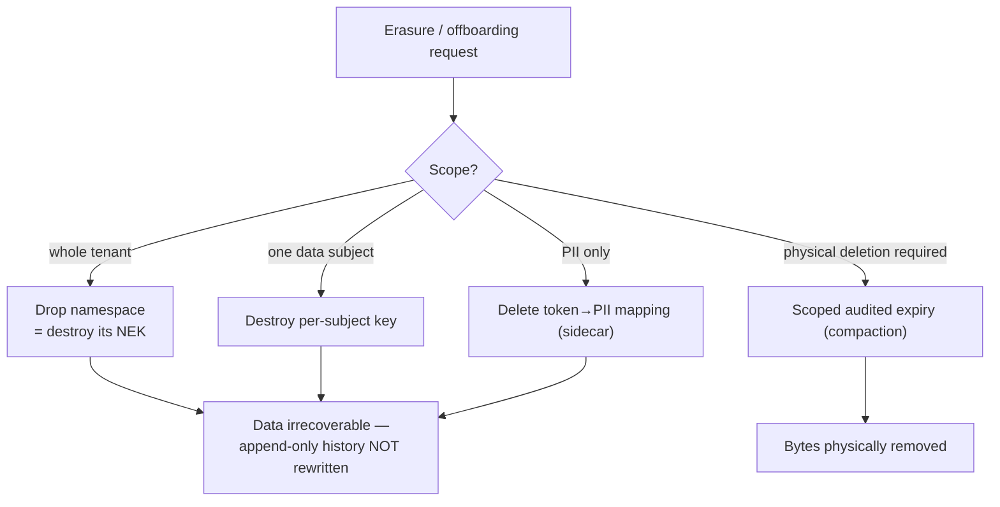

# 10 — Security & Compliance

> **Status:** Founding security plan. Security is a **first-class pillar** ([Charter §4](00-charter.md#4-differentiating-primitives-the-identity), [ADR-0018](adr/0018-security-auditability-pillar.md)), not substrate — Stele targets financial and heavily-audited systems. Nothing here is built this session; the model is defined so security is designed *in*, not bolted on.
> **Read with:** [01 §B.8](01-feature-plan.md#b8--security-authz--data-protection-pillar) (the feature list) · [06 — Testing](06-testing-strategy.md) (how we prove it) · [08 — Packaging](08-packaging-distribution-and-releases.md) (supply-chain integrity) · ADRs [0018](adr/0018-security-auditability-pillar.md)/[0019](adr/0019-encryption-at-rest-kms.md)/[0020](adr/0020-crypto-shredding-erasure.md).

## The thesis: audit-native *is* security-native

Stele's identity primitives are, almost one-for-one, security primitives:

| Identity primitive | …is also a security property |
|---|---|
| Append-only / immutable storage | **Tamper-resistance** — history can't be silently rewritten. |
| Lineage & provenance (who/what/when) | **Attribution & non-repudiation** — every change is attributable. |
| As-of / time-travel | **Forensics** — reconstruct exactly what the system held at any past instant. |
| Hash-chained / Merkle commits | **Cryptographic verifiability** — an external auditor can prove history wasn't altered. |
| Immutable audit log | **Tamper-evident audit trail** — built in, not an app-side table. |

So elevating security to a pillar isn't scope creep against the [Charter's focus guardrail](00-charter.md#3-the-guardrail--lead-with-the-non-goal) — it's naming what the identity already delivers. **The discipline** ([ADR-0018](adr/0018-security-auditability-pillar.md)): be *world-class* at the security that flows from the audit-native identity; be *excellent* at the table-stakes controls regulated buyers require (this document); and still **not** chase generic security features unrelated to the identity.

## 1. Security principles

1. **Secure by default.** TLS on, telemetry off ([ADR-0015](adr/0015-telemetry-opt-in.md)), no default passwords, least privilege, minimal network exposure, identity port not 5432 ([ADR-0017](adr/0017-default-network-port-5454.md)).
2. **Defense in depth.** No single control is load-bearing; layers compose (network → authN → authZ → encryption → audit → memory safety).
3. **Least privilege everywhere.** Roles, deployment, and the engine's own internals.
4. **Memory-safe by construction.** Rust eliminates whole exploit classes; `unsafe` is minimized and continuously checked ([§8](#8-memory-safety--exploit-protection)).
5. **Auditable by design.** Every security-relevant action is attributable and tamper-evident via the provenance substrate.
6. **No production data until the [trust gate](#12-security--the-trust-gate) is met** — including its security criteria.
7. **Verifiable, not just asserted.** Source-available (BSL), signed artifacts ([08](08-packaging-distribution-and-releases.md)), published threat model — claims you can check.

## 2. Threat model

A lightweight, living threat model; deepened per feature in the [secure SDLC](#11-secure-sdlc--vulnerability-management).

**Assets:** customer data at rest and in transit; the immutable history & audit log; encryption keys; credentials/secrets; the admin/control-plane surface; build/release artifacts.

**Trust boundaries:**

**Threat actors (illustrative):** external network attacker; malicious/curious authenticated user; compromised client credential; malicious insider/operator; supply-chain attacker; a cloud/storage provider with access to raw bytes (mitigated by at-rest encryption + BYOK).

**STRIDE sketch:** *Spoofing* → strong authN (SCRAM/mTLS/SSO); *Tampering* → append-only + hash-chained audit + checksums; *Repudiation* → provenance/non-repudiation; *Information disclosure* → encryption in transit/at rest, RLS/CLS/masking; *Denial of service* → rate limits/quotas/cost guards; *Elevation of privilege* → least-privilege RBAC + memory safety + minimal `unsafe`.

**Explicitly out of scope (documented honestly):** physical security of the operator's own infrastructure; correctness of a user's own application logic; protecting data from an attacker who legitimately holds a decryption key; side-channel hardening beyond reasonable measures (revisited if a use case demands it).

## 3. Identity-driven security (the differentiator)

The [A.2 immutability](01-feature-plan.md#a2--append-only--immutable-storage--historization) and [A.4 lineage/provenance](01-feature-plan.md#a4--lineage--provenance-first-class) primitives provide, for free, what most systems bolt on:

- **Tamper-evidence:** sealed segments are immutable and checksummed; a destructive change is impossible through normal paths and detectable otherwise ([architecture invariants](02-architecture.md#12-cross-cutting-architectural-invariants)).
- **Cryptographic verifiability (headline):** a **hash-chained commit log (from ~v0.2)** plus **Merkle inclusion/consistency proofs (by ~v0.5)** let an auditor verify history wasn't altered — *without trusting the operator* ([ADR-0026](adr/0026-verifiable-audit-log.md)). Field-level [crypto-shredding](adr/0020-crypto-shredding-erasure.md) preserves these proofs for unaffected records (proofs are over commitments, not cleartext).
- **Forensics by time-travel:** "what did the system hold at 02:00 on the day of the incident, and who wrote it?" is a query, not a backup restore.
- **Non-repudiation:** every version carries its writing principal and commit time, captured at commit, stored inline.

This is why an audit-native engine is the *right* foundation for regulated data: the integrity controls auditors ask for are the engine's native behavior.

## 4. Data protection — encryption

### In transit
TLS for pg-wire and the [admin API](09-ecosystem-and-products.md#2-the-admin--control-plane-api-the-shared-substrate), with an **mTLS** option for service-to-service and operator use. Modern ciphers only; secure defaults.

**Landed for pg-wire (v0.3, STL-251)** via the standard Postgres `SSLRequest` negotiation (rustls; the library ships only modern cipher suites, so a weak-cipher configuration is impossible). Operators point `[tls]` in `stele.toml` at PEM cert/key paths; `mode = "required"` (the default once `[tls]` is present) refuses plaintext startups with `FATAL` SQLSTATE `28000`, and `"optional"` is the migration posture. Setting `client_ca` switches on **mTLS**: the handshake rejects any client not presenting a certificate chaining to that CA. The **secure-default posture** is enforced at boot, not documented-and-hoped: a non-dev server **without TLS on a non-loopback bind mints an ephemeral self-signed certificate** so the listener is encrypted (TLS `required`) rather than refusing to boot or silently serving plaintext — with a loud warning that the certificate is *unauthenticated* (clients cannot verify the server) and *ephemeral* (regenerated each restart), so it must be replaced with a CA-issued cert before production (STL-304). Plaintext is still allowed only on loopback, with a loud warning; `--dev` stays friction-free for the five-minute path. **The verified mTLS client identity becomes the session's write principal (STL-291):** once the handshake verifies the client certificate against `client_ca`, its subject CN (else its first SAN) is parsed out and recorded as the connection's principal, so provenance attributes each write to who actually connected rather than to an unauthenticated startup `user`. Precedence against the startup `user` and SCRAM is documented under [§5](#5-authentication).

### At rest (envelope encryption)
Per [ADR-0019](adr/0019-encryption-at-rest-kms.md): **envelope encryption with a three-tier key hierarchy** — each segment is encrypted with a per-segment **data key (DEK)**; DEKs are wrapped by a **per-namespace key (NEK)**; NEKs are wrapped by a root **key-encryption key (KEK)** held in a KMS. Immutable segments make this clean (a sealed segment's key never changes), and the per-namespace layer is what enables both per-tenant BYOK and instant [namespace-drop erasure](#the-append-only-vs-right-to-erasure-tension-handled-not-hand-waved).

- **External KMS + BYOK/HYOK:** pluggable KMS (AWS KMS, GCP KMS, Azure Key Vault, HashiCorp Vault); customers can **bring/hold their own key** (per deployment or per namespace) — revoking it instantly renders the affected data unreadable.
- **Per-namespace keys** make a namespace the unit of crypto-isolation: destroying a namespace's NEK renders that whole tenant's data unreadable everywhere, including backups — the [namespace-drop erasure](#the-append-only-vs-right-to-erasure-tension-handled-not-hand-waved) primitive — and lets each tenant hold its own key.
- **Key rotation:** rotate KEKs/NEKs without re-encrypting all data (re-wrap the layer below); DEK rotation on compaction.
- **Encrypted backups & object tier:** the cold object-store tier and backups inherit the same at-rest encryption end to end — encryption is a property of the segment, wherever it lives.

## 5. Authentication

- **SCRAM-SHA-256** (Postgres-compatible, so existing clients work) and **mTLS**; **admin-API tokens** for automation.
- **Federated identity (OIDC / SSO / SAML)** for the admin surfaces — later (v1.0+), important for enterprise.
- No default credentials; first-run forces credential setup.

### Shipped at v0.3 (STL-252): SASL SCRAM-SHA-256 on pg-wire

The standard Postgres `AuthenticationSASL` exchange (RFC 5802/7677) — psql,
psycopg, pgjdbc, and `tokio-postgres` all speak it natively:

- **Verifiers, never passwords.** `CREATE USER <name> PASSWORD '…'` derives a
  salted, iterated SCRAM verifier (`StoredKey`/`ServerKey`, 4096 iterations —
  the Postgres default) and appends it to the durable catalog log (ADR-0028),
  so the user store survives restarts via the same replay as the schema.
  `ALTER USER … PASSWORD` rotates under a fresh salt; `DROP USER` removes.
  The crypto is vendored in `stele_common::scram` (like the commit-log
  SHA-256) and pinned to the published RFC test vectors; OS entropy
  (`getrandom`) supplies salts and per-exchange server nonces.
- **Passwords are SASLprep-normalized** (RFC 4013) before derivation, with the
  Postgres fallback to raw UTF-8 bytes when the input is prohibited (STL-298).
  Both derivation sites — the server's `CREATE`/`ALTER USER` verifier and a
  SCRAM client's proof — share one normalization step, so a non-ASCII password
  composed on one side and decomposed on the other still authenticates; ASCII is
  byte-identical and untouched. SASLprep is the one third-party dependency in the
  otherwise-vendored auth path (`stringprep`, for the Unicode NFKC tables that
  cannot be hand-vendored — [ADR-0033](adr/0033-saslprep-password-normalization.md)).
- **Policy is `[auth] mode = trust | scram`** in `stele.toml` (dev default
  `trust`; a bare `[auth]` section means `scram` — configuring authentication
  means wanting it, the §4 posture). A non-dev `trust` boot warns unless mTLS
  is on (the client certificate is then the identity).
- **Failures don't enumerate.** A wrong password and an unknown user both run
  a full exchange (a mock verifier for the unknown) and fail with the same
  `FATAL` `28P01`. Fresh server nonces make a captured exchange unreplayable;
  the server-final `v=` signature authenticates the server back to the client.
- **Bootstrap** (no default credentials): boot once *without* `[auth]` —
  trust is loopback-plaintext-only or behind `[tls]` per §4 — run
  `CREATE USER`, then enable `[auth]` and restart; verifiers are durable.
- **Channel binding over TLS (STL-297):** on a TLS connection whose certificate
  yields a `tls-server-end-point` binding (RFC 5929), the server advertises
  `SCRAM-SHA-256-PLUS` first and folds the certificate's SHA-256 into the `c=`
  check, so a man-in-the-middle that terminates TLS with a different certificate
  cannot relay a captured proof. The RFC downgrade rule is enforced: over a
  PLUS-advertising channel a `y` gs2 flag (the client believing the server has no
  channel binding) is refused. Off TLS — or for a certificate whose signature
  hash is not one we bind with SHA-256 — only plain SCRAM is offered, and a
  `p=…` demand is refused as before. The plain floor still authenticates over TLS
  for a client that opts out with `n`. The bundled `stele shell` client is
  symmetric (STL-334): over TLS it prefers `SCRAM-SHA-256-PLUS`, computing the
  binding from the certificate the handshake negotiated with the same RFC 5929
  §4.1 hash selection as the server, so both sides derive the identical `c=`; it
  falls back to plain `n` (never `y`) off TLS or for a certificate it cannot bind.
- **Deliberate v0.3 floor, filed as a follow-up:** `tls-server-end-point` binding
  for SHA-384/512-signed server certificates (today PLUS is advertised only for
  SHA-256-signed certs; a stronger-hash cert falls back to plain SCRAM — STL-330,
  on both the server and the shell client). The authenticated identity reaches
  the connection trace span (STL-107) **and the stored write provenance**: each
  wire-issued write stamps the connection's identity into `_stele_principal`
  (STL-300/STL-291), set per statement under the engine lock so a shared engine
  attributes each row to whoever wrote it.

#### Which identity is the principal (precedence)

The write principal is the **strongest verified identity** the connection
offers, in order (STL-291):

1. **SCRAM-verified user** (`auth = scram`) — a password-proven database
   principal is authoritative; it wins even when a client certificate is also
   presented (the certificate then identifies the *transport peer*, recorded on
   the trace span, while the row is attributed to the database actor).
2. **Verified mTLS client certificate** — the subject CN, else the first SAN.
   It is CA-proven, so it overrides an unauthenticated startup `user` taken on
   faith. This is the `trust`-plus-mTLS case ("the client certificate is then
   the identity", §4).
3. **Startup `user`** — `trust`, no client certificate.
4. **Server default `stele`** — only a malformed startup omits `user`.

Enforcing a certificate↔`user` match, or mapping a certificate onto a different
database role, is a deliberate follow-up: today a verified certificate simply
*is* the principal.

## 6. Authorization

Layered, least-privilege:

- **RBAC** — `GRANT`/`REVOKE` on objects; roles composed for least privilege (v0.5).
- **Row-level security (RLS)** — policy-based row visibility, pairing naturally with the audit/lineage model (v0.5).
- **Column-level security & dynamic masking** — column grants plus masking/redaction of sensitive fields (PII/PHI/PAN) so analysts see only what they're entitled to (v0.7).
- **ABAC / policy engine** — attribute/policy-based access (purpose, data classification, clearance) beyond static roles (v0.7+).
- The **admin/control-plane API shares the same identities and authZ** as the SQL surface ([ADR-0016](adr/0016-admin-control-plane-api.md)) — one authorization model, not two.
- **Temporal access control.** Time-travel must never become a privilege-escalation channel: an as-of read enforces the **current** access policy by default (you cannot read data as-of a time *before* you had access), with an optional as-of-policy mode where a use case genuinely requires it.

## 7. Access auditing & monitoring

- **Every access logged** (read and write) with principal, time, and statement digest — built on the provenance infrastructure, not a bolt-on audit table.
- **Tamper-evident:** the access/audit log is itself append-only and hash-chained ([§3](#3-identity-driven-security-the-differentiator)).
- **SIEM export** (e.g., to Splunk/Elastic) and **anomaly hooks** for unusual access patterns.
- **Separation of duties:** audit records can be made readable by an auditor role that cannot modify data, and vice-versa.

## 8. Memory safety & exploit protection

The concrete, technical security the [Charter principle](00-charter.md#6-guiding-principles) demands:

- **Rust by construction** ([ADR-0001](adr/0001-implementation-language-rust.md)) eliminates buffer overflows, use-after-free, and data races — the exploit classes behind most database CVEs.
- **`unsafe` is minimized, justified, and gated** by **Miri + ASan/TSan/UBSan + fuzzing** ([06](06-testing-strategy.md)); the segment-format and pg-wire/WAL parsers are fuzzed against hostile input so a malicious file or packet is *detected*, never an RCE.
- **Supply-chain integrity:** every artifact is signed (cosign), with SBOM + SLSA provenance ([08 §9](08-packaging-distribution-and-releases.md#9-supply-chain--artifact-integrity)); `cargo-deny`/`cargo-audit` gate every build; only vetted, license-compatible dependencies ship.
- **No dynamic code execution surfaces** by default; UDFs (later) are sandboxed and opt-in.
- **Reproducible builds** ([ADR-0005](adr/0005-reproducible-builds-pinned-toolchain.md)) let third parties verify a binary matches its source.

## 9. Hardening & operational security

- **Secure defaults** ([§1](#1-security-principles)); minimal attack surface (only the ports you enable; identity port [5454](adr/0017-default-network-port-5454.md)).
- **Rate limiting / DoS resistance:** connection and query quotas, resource limits, query-cost guards.
- **Secrets handling:** no plaintext secrets at rest; integration with external secret stores; secrets never logged.
- **Least-privilege deployment:** the [K8s operator](09-ecosystem-and-products.md#5-kubernetes--openshift-operator) runs with least privilege, non-root containers, read-only filesystems where possible, network policies; OpenShift SCC-compatible.
- **Tenant isolation via namespaces:** namespaces/schemas are a first-class isolation **and lifecycle** unit — each can carry its own encryption key (NEK), residency, and access policy, and supports an **audited drop** that offboards a whole tenant as a clean break ([§10](#the-append-only-vs-right-to-erasure-tension-handled-not-hand-waved)). Row/column security covers soft multi-tenancy *within* a namespace.

## 10. Compliance roadmap

Stele is built so these are **achievable**, and its audit-native nature is a genuine head start — but they are **roadmap targets, not current claims**, gated to the [trust gate](#12-security--the-trust-gate) and the eventual commercial/cloud phase. Frameworks confirmed in scope: **SOC 2 Type II, HIPAA, PCI-DSS, GDPR / data residency.**

| Framework | What it needs | How Stele helps | Where the work is |
|---|---|---|---|
| **SOC 2 Type II** | Security/availability/confidentiality controls, evidenced over time. | Audit-native logging, immutability, access controls, signed/repro builds give strong evidence. | Process + controls maturity; org-level (commercial entity), not just engine. |
| **HIPAA** (PHI; ties to Solvia/RCM) | Access controls, audit controls, integrity, transmission security, encryption. | Provenance = audit controls; immutability = integrity; encryption in transit/at rest; RLS/CLS/masking for minimum-necessary. | BAA + admin/operational controls; masking of PHI. |
| **PCI-DSS** (cardholder data) | Encryption, access control, logging, key management, network security. | At-rest encryption + KMS/BYOK, RBAC, tamper-evident audit, masking of PAN, rate limiting. | Key-management rigor, scoping, segmentation. |
| **GDPR / data residency** | Lawful basis, data-subject rights incl. **erasure**, residency controls. | Provenance/lineage for transparency; per-namespace residency (region-pinned object store); **layered erasure** (namespace-drop + crypto-shredding) for the append-only tension (next). | The append-only ↔ erasure tension, handled below. |

### The append-only vs. right-to-erasure tension (handled, not hand-waved)

An append-only engine appears to conflict with the right to erasure. Stele resolves it with a **layered strategy** ([ADR-0020](adr/0020-crypto-shredding-erasure.md)) — the engine provides composable mechanisms; the controller (the app / Solvia) picks per scenario and sets policy:

1. **Namespace-drop (primary, for tenant offboarding).** Each namespace/tenant has its own key (NEK, [§4](#at-rest-envelope-encryption)). "Drop namespace" **destroys that key** — the entire tenant's data becomes unreadable instantly, everywhere including backups, with space reclaimed lazily by compaction. A clean break that *preserves* append-only immutability (segments are orphaned, never rewritten).
2. **Per-subject crypto-shredding (fine-grained backstop).** To erase a single data subject inside a live namespace, encrypt that subject's data under a per-subject key and destroy it.
3. **PII sidecar / pseudonymization.** Keep erasable PII out of the immutable core where possible: store a token, with the token→PII mapping in a small mutable side-store; erase = drop the mapping.
4. **Scoped, audited physical retention/expiry** ([01 §A.2](01-feature-plan.md#a2--append-only--immutable-storage--historization)) for cases that legally require true physical deletion.

The conceptual line: **history *within* a dataset is immutable (never rewritten); the *lifecycle of a whole namespace* — create, decommission — is a legitimate, audited, coarse operation.** Decommissioning a dataset isn't rewriting history.

Honest caveat: financial/healthcare records frequently carry **legal retention obligations** that lawfully override erasure (a recognized GDPR basis) — in the [target market](00-charter.md#1-what-stele-is), whole-tenant offboarding is the dominant real case, not per-individual erasure. Stele provides the *mechanisms*; the data controller (the application / Solvia) sets policy. The engine never decides law — it gives the controls to comply.

## 11. Secure SDLC & vulnerability management

- **Threat-model per significant feature**; security review folded into the [ADR](adr/README.md) process for security-relevant decisions.
- **Continuous checks:** sanitizers, Miri, fuzzing, `cargo-audit`/`cargo-deny` in CI ([04](04-cicd.md)); security regressions block merge.
- **Coordinated vulnerability disclosure:** `SECURITY.md` with a private channel and response expectations; advisories via GitHub Security Advisories ([07 §contribution](07-licensing-and-oss.md#contribution-model)).
- **Signed, reproducible releases** ([08](08-packaging-distribution-and-releases.md)); SBOM per release so downstream users can assess exposure quickly.
- **Incident response** runbook (a documented gap to flesh out before production).

## 12. Security & the trust gate

The [Charter's trust gate](00-charter.md#8-the-trust-gate-no-production-data-stated-plainly) gains explicit security criteria. **All green before any production data:**

- [ ] Encryption in transit (TLS/mTLS) and at rest (envelope + KMS) implemented and tested.
- [ ] AuthN (SCRAM/mTLS) + RBAC + row/column security enforced, with tests.
- [ ] Tamper-evident access/audit logging verified.
- [ ] Memory-safety regime green: minimal `unsafe`, Miri + sanitizers + fuzzing clean ([06](06-testing-strategy.md)).
- [ ] Supply-chain integrity: signed artifacts, SBOM, SLSA provenance ([08](08-packaging-distribution-and-releases.md)).
- [ ] A documented, reviewed threat model and a passing security review.
- [ ] Crypto-shredding erasure path proven by test.

## 13. Security by milestone

| Milestone | Security capability |
|---|---|
| **v0.1** | Memory-safety regime from line one (Rust + sanitizers/fuzz); secure-by-default posture. |
| **v0.3** | TLS/mTLS, SCRAM authN, secure defaults, admin-API auth. |
| **v0.5** | RBAC, row-level security, encryption at rest (+ encrypted backups), tamper-evident access auditing, rate limiting, secrets handling. |
| **v0.7** | Column security + masking, external KMS/BYOK, cryptographic audit verifiability, crypto-shredding erasure, ABAC. |
| **v1.0** | Completed security baseline; federated SSO; threat model + security review; SOC 2 readiness; HIPAA/PCI control mappings. |
| **v2.0+** | Distributed-deployment security (mTLS mesh, per-tenant keys); cloud compliance posture; formal certifications via the commercial entity. |

---

*Security decisions: the pillar elevation ([ADR-0018](adr/0018-security-auditability-pillar.md)), encryption at rest + KMS ([ADR-0019](adr/0019-encryption-at-rest-kms.md)), crypto-shredding for erasure ([ADR-0020](adr/0020-crypto-shredding-erasure.md)). Feature list: [01 §B.8](01-feature-plan.md#b8--security-authz--data-protection-pillar). Proof: [06 — Testing](06-testing-strategy.md).*
