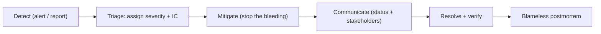

# 11 — Operations & Runbooks

> **Status:** Founding operational plan. Stele holds **no production data yet** ([trust gate](00-charter.md#8-the-trust-gate-no-production-data-stated-plainly)); these runbooks are defined early so that *when* it does, operators aren't improvising.
> **Read with:** [09 — Operator](09-ecosystem-and-products.md#5-kubernetes--openshift-operator) (automation) · [10 — Security](10-security-and-compliance.md) · [06 — Testing](06-testing-strategy.md) (recovery is proven, not hoped) · [08 — Releases](08-packaging-distribution-and-releases.md).

Operating an audit-native engine has one overriding rule: **never trade correctness or history for availability.** When in doubt, a node fences itself, a query refuses rather than returns a wrong answer, and recovery is exact. These runbooks encode that posture.

## 1. Health & monitoring

Stele exposes Prometheus/OpenMetrics, OpenTelemetry traces, structured logs, and health/readiness endpoints ([01 §B.9](01-feature-plan.md#b9--observability--operability)). The signals that actually predict trouble for *this* engine:

| Signal | Why it matters | Alert when |
|---|---|---|
| **WAL lag / fsync latency** | The durability point ([02 §3.4](02-architecture.md#34-write-path-sequence)); rising latency = ingest risk. | p99 fsync > budget; WAL backlog growing. |
| **Compaction backlog** | If compaction falls behind, the delta tier and read amplification grow. | Backlog > threshold; oldest unmerged delta age. |
| **Cache hit rate / tier restore queue** | Cold/[frozen-tier](02-architecture.md#storage-lifecycle-tiered-archival-controlling-append-only-growth) misses drive latency + retrieval cost. | Hit rate drop; pending `RESTORE` jobs piling up. |
| **Clock skew** (distributed) | System-time ordering is correctness-critical ([ADR-0022](adr/0022-clock-synchronization-and-ordering.md)). | Skew approaching the max-skew bound. |
| **Storage growth / cost** | Append-only grows forever ([§7](#7-capacity--cost)). | Growth rate anomaly; tier-mix drift. |
| **Replica lag** (distributed) | Stale reads / failover readiness. | Lag > target. |
| **KMS reachability** | No KMS → no decrypt of at-rest data ([ADR-0019](adr/0019-encryption-at-rest-kms.md)). | KMS errors / latency. |
| **Temporal-specific metrics** | You can't benchmark or debug what you can't see — instrument *before* perf work. | per-query block reads, **version-chain depth**, **visibility lag** (submit→queryable), clock-uncertainty window, compaction stats. |

### 1.1 First dashboard (the v0.3 shipped metric set — STL-253)

The server exposes an **ops HTTP listener** on a port distinct from pg-wire —
default `0.0.0.0:9090`, configured by `[telemetry] metrics` in `stele.toml`
([05 — configuration](05-dev-environment.md#configuration)); the admin HTTP
gateway will share this listener ([ADR-0016](adr/0016-admin-control-plane-api.md)):

| Endpoint | Meaning |
|---|---|
| `GET /healthz` | Liveness: `200` whenever the process answers. |
| `GET /readyz` | Readiness: `200` only once **recovery completed** and **no table's WAL is poisoned** (a failed fsync — STL-217). The listener binds *before* recovery, so a (re)start is observable as `503 → 200`; a poisoned engine flips it back to `503` and the remedy is a restart into recovery. Wire this to the orchestrator's readiness probe. |
| `GET /metrics` | Prometheus/OpenMetrics text exposition. `503` until recovery completes. |

Scrape config:

```yaml
# prometheus.yml
scrape_configs:
  - job_name: stele
    scrape_interval: 15s
    static_configs:
      - targets: ["stele-host:9090"]
```

**The metric names are stable.** Renaming or re-labeling any series below is a
breaking change to operators' dashboards and gets the same deprecation
discipline as a SQL surface change ([ADR-0014](adr/0014-release-channels-and-versioning-policy.md)).

| Series | Type | Meaning |
|---|---|---|
| `stele_connections_active` | gauge | Open pg-wire connections. |
| `stele_connections_total` | counter | Connections ever accepted. |
| `stele_statements_total{kind}` | counter | Successfully executed statements; `kind` ∈ `select` `insert` `update` `delete` `merge` `ddl` `admin`. Errored statements are **not** counted here — they land in `stele_statement_errors_total`, so total attempted throughput is the sum of both. |
| `stele_statement_seconds{kind}` | histogram | Statement latency; `kind` ∈ `select` `dml` `ddl`. |
| `stele_statement_errors_total` | counter | Statements that returned an error. |
| `stele_rows_returned_total` | counter | Rows returned by `SELECT`s. |
| `stele_rows_written_total` | counter | Rows written by DML (counted at statement execution; a later `ROLLBACK` does not subtract). |
| `stele_txn_commits_total` / `stele_txn_rollbacks_total` / `stele_txn_conflicts_total` | counter | Transaction outcomes; conflicts are first-committer-wins refusals (retryable). |
| `stele_wal_appends_total` | counter | WAL records staged, across every table's WAL. |
| `stele_wal_fsync_seconds` | histogram | **The durability point** ([02 §3.4](02-architecture.md#34-write-path-sequence)): group-commit and segment-rotation fsync latency; `_count` is the fsync count. |
| `stele_flush_seconds` / `stele_checkpoint_seconds` | histogram | Flush (seal delta → segment) and checkpoint (durability fence) durations; `_count` is successful runs. |
| `stele_compaction_seconds` | histogram | Compaction (merge sealed segments into one, retiring inputs — STL-231) duration; `_count` is successful runs. |
| `stele_scan_segments_scanned_total`, `stele_scan_segments_pruned_zone_total`, `stele_scan_segments_pruned_superseded_total`, `stele_scan_row_groups_scanned_total`, `stele_scan_row_groups_pruned_zone_total` | counter | Snapshot-scan pruning accounting (STL-146/STL-173): how much sealed data reads actually touch vs. skip. |

Compaction and backup series land with their features (STL-231 / STL-249).

**The five queries an operator looks at first:**

```promql
# 1. p99 fsync latency — ingest is at risk before anything else shows it.
histogram_quantile(0.99, rate(stele_wal_fsync_seconds_bucket[5m]))

# 2. p99 SELECT latency, and statement throughput by kind.
histogram_quantile(0.99, rate(stele_statement_seconds_bucket{kind="select"}[5m]))
sum by (kind) (rate(stele_statements_total[5m]))

# 3. Error + conflict pressure. Conflicts are retryable; a climb means hot keys.
rate(stele_statement_errors_total[5m]) + rate(stele_txn_conflicts_total[5m])

# 4. Prune effectiveness — near 0 on a growing table means zone maps aren't
#    helping and a flush/compaction or predicate shape needs a look.
rate(stele_scan_segments_pruned_zone_total[5m])
  / clamp_min(rate(stele_scan_segments_scanned_total[5m])
              + rate(stele_scan_segments_pruned_zone_total[5m])
              + rate(stele_scan_segments_pruned_superseded_total[5m]), 1e-9)

# 5. Alert: not-ready. `/readyz` ≠ 200 — fires across crash-loops AND a
#    poisoned WAL (the engine refuses writes until restarted into recovery).
probe_success{job="stele-readyz"} == 0   # via blackbox_exporter on /readyz
```

## 2. Incident response

A blameless, severity-driven process (the engineering `incident-response` workflow applies).

**Severity levels:**

| Sev | Meaning | Examples |
|---|---|---|
| **SEV1** | Data integrity at risk, or total outage. | Suspected history corruption; recovery failing; all nodes down. |
| **SEV2** | Major degradation, no integrity risk. | Object-store outage; KMS down (reads fail); sustained ingest stall. |
| **SEV3** | Partial / recoverable degradation. | One replica lagging; compaction behind; frozen-tier restore slow. |
| **SEV4** | Minor / cosmetic. | Non-critical metric gap; noisy log. |

**Flow:**



- **Integrity first:** any *suspicion* of history corruption is SEV1 — **stop writes, isolate, snapshot, and use [time-travel/cryptographic verifiability](10-security-and-compliance.md#3-identity-driven-security-the-differentiator) to establish exactly what is and isn't affected** before any remediation. Never "fix" by mutating segments.
- **Roles:** Incident Commander (coordinates), Ops (hands-on), Comms (stakeholders). One person may wear several hats early; escalate.
- **Postmortem:** blameless, fact-based, with concrete follow-ups; if the failure mode wasn't covered by the [simulation harness](06-testing-strategy.md#5-deterministic-simulation-testing-dst--the-centerpiece), the follow-up is to add it as a seed.

## 3. Disaster recovery

| Objective | Target posture |
|---|---|
| **RPO** (data loss) | Bounded by WAL durability + backup cadence; near-zero with synchronous WAL/replication. |
| **RTO** (downtime) | Bounded by recovery (WAL replay) + restore time; the [object-store-native model](08-packaging-distribution-and-releases.md) makes restore largely a re-point, not a copy. |

- **The append-only dividend:** because segments are immutable and the object tier *is* the durable copy, DR is mostly "point new compute at the existing manifest + replay WAL." Backups are incremental and natural ([01 §B.6](01-feature-plan.md#b6--backup-restore--snapshots)).
- **PITR:** recover to any system-time — trivial by the model, and **proven by test** ([06](06-testing-strategy.md)), not assumed.
- **Region failover:** with cross-region object replication, promote compute in the surviving region; clock-sync ([ADR-0022](adr/0022-clock-synchronization-and-ordering.md)) and the manifest must be consistent first.
- **Drills:** restore + PITR drills are run on a schedule (a restore you haven't tested is not a backup). For high-stakes changes, a subagent/CI restore-verification gate.

## 4. Common failure scenarios & remediation

| Symptom | Likely cause | First actions |
|---|---|---|
| **Writes stalling, WAL growing** | Compaction/flush behind; slow disk; back-pressure. | Check compaction backlog + disk; throttle ingest; scale compute; never delete WAL manually. |
| **Reads failing with decrypt errors** | KMS unreachable / key revoked ([ADR-0019](adr/0019-encryption-at-rest-kms.md)). | Restore KMS connectivity; check key policy/rotation; if a NEK was destroyed, that namespace is intentionally [shredded](adr/0020-crypto-shredding-erasure.md). |
| **Node fenced / dropped from cluster** | Clock skew beyond max bound ([ADR-0022](adr/0022-clock-synchronization-and-ordering.md)). | Fix NTP/PTP on that node; do **not** widen the bound to mask it; rejoin once synced. |
| **Query hangs / "restore required"** | Query touched [frozen tier](02-architecture.md#storage-lifecycle-tiered-archival-controlling-append-only-growth). | Issue `RESTORE` for the needed segments; expect hours for Deep Archive; the planner should have estimated this. |
| **Object-store outage** | S3/backend unavailable. | Serve from hot cache where possible; pause cold reads; wait/failover region; integrity is unaffected (immutable). |
| **Checksum / corrupt-segment error** | Bit rot / torn write. | Segment is detectably bad ([02 §3.2](02-architecture.md#32-on-disk-segment-format)); restore that segment from backup/replica; file an incident + sim seed. |
| **Replica lag rising** | Slow apply / network. | Check apply rate + link; consider read rerouting; assess failover readiness. |
| **Storage cost spiking** | Tiering misconfigured / hot data not aging down. | Review [tiering policy](adr/0021-storage-lifecycle-tiered-archival.md) + tier mix; verify time-era compaction is running. |
| **Boot warns: "generated an ephemeral self-signed certificate"** | Secure-defaults posture ([10 §4](10-security-and-compliance.md#4-data-protection--encryption), STL-304): a non-dev server without `[tls]` on a non-loopback bind encrypts with a generated cert (rather than refusing to boot or serving plaintext) — but the cert is unauthenticated and regenerated each restart. | Configure `[tls]` in `stele.toml` with a **CA-issued** `cert`/`key` (see [`stele.example.toml`](../stele.example.toml)) so clients can verify the server and the cert survives restarts. Don't ship the self-signed fallback to production, and don't "fix" it by running `--dev`. |
| **Clients failing with `FATAL 28000: connection requires TLS`** | `[tls] mode = "required"` and the client connected plaintext. | Point the client at TLS (`sslmode=require`/`verify-full`, `stele shell --tls require`); for a migration window set `mode = "optional"` (the boot log warns while it's on). |
| **TLS clients failing after a certificate change** | Expired/rotated cert; key/cert mismatch (`[tls]` is read once at boot). | Check expiry (`openssl x509 -enddate -noout -in server.crt`); fix the pair and restart the server (live reload is a planned follow-up); mTLS rejects also mean a client cert no longer chains to `client_ca`. |

> Recurring rule across all rows: **diagnose with time-travel, remediate without mutating history.** The engine's own primitives are the best forensic tools.

## 5. Backup & restore

- **Backup:** consistent, online, incremental (ship new sealed segments + WAL + catalog). In the separated model the object tier already holds durable, immutable segments; backup adds catalog/WAL consistency points and (optionally) cross-region copies. Backups are **encrypted** end to end ([10 §4](10-security-and-compliance.md#4-data-protection--encryption)).
- **Restore:** re-point compute at the backup's manifest, verify segment checksums, replay WAL to the target consistency point. Restore = source, **byte-for-byte and including full history + provenance** ([06](06-testing-strategy.md)).
- **Verify:** every restore drill checks an integrity oracle + a known as-of query, not just "it started."

## 6. Upgrades

- **Format-compatibility-aware rolling upgrades** via the [operator](09-ecosystem-and-products.md#5-kubernetes--openshift-operator): a newer engine always reads older [on-disk format](adr/0002-on-disk-storage-format.md) (forward-compatible from v1.0), so nodes upgrade one at a time with no data rewrite.
- **Pre-upgrade:** confirm CI green for the target version, snapshot/backup, check the [compatibility matrix](08-packaging-distribution-and-releases.md#7-versioning--compatibility-policy-the-important-part).
- **Rollback:** because the format is forward-compatible and segments immutable, roll back compute to the prior version; document any format-version floor before downgrading.

## 7. Capacity & cost

- **Storage growth is monotonic** (append-only) — monitor growth rate and **tier mix** ([ADR-0021](adr/0021-storage-lifecycle-tiered-archival.md)); the lever for cost is tiering (keep data, make it cheap), *not* deletion.
- **Retrieval cost** is bounded by zone-map pruning before rehydration; watch the frozen-tier `RESTORE` volume and warn on large/expensive thaws.
- **Compute** scales independently of storage ([ADR-0007](adr/0007-storage-compute-separation.md)); size by query concurrency + working-set cache, not by total data.

## 8. On-call & escalation

- Clear severity → response-time expectations; documented escalation path; IC rotation.
- Alerts map to the [§1 signals](#1-health--monitoring) and the [§4 runbook rows](#4-common-failure-scenarios--remediation) so a page links straight to its remediation.
- A `SECURITY.md` private channel handles security incidents distinctly ([10 §11](10-security-and-compliance.md#11-secure-sdlc--vulnerability-management)).

---

*This is a planning runbook; operational specifics (exact thresholds, dashboards, escalation SLAs) are filled in as the engine approaches its first real deployment — gated by the [trust gate](06-testing-strategy.md#9-what-tested-enough-to-hold-real-data-means-the-trust-gate-operationalized).*
