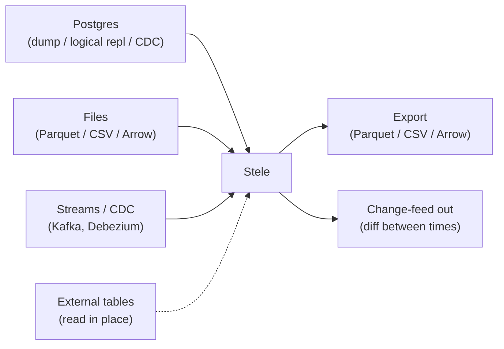

# 12 — Data Migration & Interoperability

> **Status:** Founding plan for getting data **in and out**. Nothing built this session.
> **Read with:** [01 §A.5/A.1](01-feature-plan.md#a5--hash-keys--mergeupsert) (ingest/temporal) · [02 — Architecture](02-architecture.md) · [07 — Licensing](07-licensing-and-oss.md) (open formats, no lock-in).

Two principles: **easy in, easy out.** Adoption requires low-friction import from the systems people already run (especially Postgres); trust requires **no lock-in** — open, exportable formats so leaving is always possible. And because Stele is **bitemporal**, migration has a dimension other databases don't: *when did each fact hold, and when was it recorded* — which we handle as a first-class concern, not an afterthought.

## 1. Ingest paths (overview)

| Path | Mechanism | When |
|---|---|---|
| **Bulk load** | `COPY` over pg-wire → columnar writer | v0.3 |
| **MERGE / upsert** | hash-keyed, temporal close/open ([01 §A.5](01-feature-plan.md#a5--hash-keys--mergeupsert)) | v0.3 |
| **File import** | Parquet / CSV / Arrow readers | v0.5 |
| **External tables** | read Parquet/CSV/Iceberg in place, no copy | v1.0+ |
| **CDC / streaming** | continuous apply from a change stream | v1.0+ |

The **wire half of bulk load is live** ([STL-236](https://allegromusic.atlassian.net/browse/STL-236)): `COPY <table> [(cols)] FROM STDIN` in text and CSV formats, the door `psql \copy` and psycopg `copy()` already know. The whole load is one crash-atomic group — a parse failure on any row leaves zero rows — and works inside a `BEGIN … COMMIT` block (read-your-own-writes). The grammar and options are in [sql-grammar.md](sql-grammar.md#bulk-load--copy--from-stdin-stl-236). Out of scope for now: `COPY TO` (export), binary format, valid-time-bound `COPY`, and the batched append fast path feeding the columnar writer directly (the sibling storage ticket).

## 2. Importing from Postgres

Because Stele speaks the [Postgres wire protocol](adr/0003-postgres-wire-protocol-early.md), the existing tooling mostly *works*:

- **Dump & load:** `pg_dump` → adjust DDL for temporal options → `COPY`/`psql` into Stele. The catalog's `pg_catalog` shims ([02 §5](02-architecture.md#5-catalog--metadata)) help tools introspect.
- **Logical replication / CDC:** stream changes (e.g., via Debezium/logical decoding) into Stele's MERGE path for an **online, low-downtime cutover** — each upstream change becomes a new bitemporal version, so the migration itself produces a clean history.
- **Schema translation:** map Postgres types to Stele types ([01 §B.2](01-feature-plan.md#b2--type-system)); decide per table whether to enable **valid-time** (opt-in) and whether to assign **hash keys**.

### Client drivers (JDBC / psycopg / pgAdmin)

Stock Postgres drivers connect **out of the box** — no Stele-specific connection options. A driver's connect-time `SET` preamble (pgjdbc's `extra_float_digits` / `application_name`, psycopg's session defaults, …) is **tolerated as a no-op** ([STL-246](https://allegromusic.atlassian.net/browse/STL-246)): every `SET`/`RESET` of a variable other than the two Stele time variables succeeds and changes nothing.

- **pgjdbc no longer needs `assumeMinServerVersion=9.4`.** That option was previously required only to fold pgjdbc's `SET` preamble into the startup packet, because the server had no `SET`; with `SET` now tolerated, a stock `jdbc:postgresql://…/stele` connection works. The CI driver gate ([`ci/JdbcSmoke.java`](../ci/JdbcSmoke.java), STL-184) connects with no such option and is itself the regression test.
- **Session time travel.** `SET stele.system_time = '…'` (and the valid-axis twin) pins a whole connection's read snapshot, so an existing reporting tool can point at a past instant without rewriting its queries — see [sql-grammar.md](sql-grammar.md#set-stelesystemvalid_time--session-time-context-stl-246). The shell's `\asof` ([STL-199](https://allegromusic.atlassian.net/browse/STL-199)) is the same idea, client-side.

## 3. Temporal-aware historical backfill (the part unique to Stele)

Loading *history* into a bitemporal store is not a plain insert — you must decide what each row's **system-time** and **valid-time** should be. Stele makes this explicit:

- **Preserve original event time as valid-time.** When importing historical records, set `valid_from`/`valid_to` from the source's real-world timestamps, so as-of-the-world queries are correct *for the past you're importing*.
- **System-time options:** either stamp all backfilled rows with the **load time** (honest: "we learned all of this at migration") or, when the source carries a trustworthy record-time, **reconstruct system-time** to reflect when each fact was originally known. The choice is documented per migration — it changes what "as we believed at T" returns.
- **SCD-2 / history tables collapse cleanly:** a slowly-changing-dimension table or an app-side audit/history table maps **directly** onto Stele's native versioning — often *removing* bespoke history machinery rather than porting it.
- **Idempotent backfill:** hash-key + system-time make re-running a backfill a no-op ([01 §A.5](01-feature-plan.md#a5--hash-keys--mergeupsert)), so large imports are safely resumable.

> This is the migration story that sells the engine: a customer's tangle of SCD-2 tables, audit triggers, and "as-of" reporting hacks becomes native, queryable, bitemporal history.

## 4. Files & open formats

- **Parquet / CSV / Arrow import & export** ([01 §B.10](01-feature-plan.md#b10--extensibility)) — the engine's in-memory representation is already [Arrow-shaped](assumptions.md), so interop is natural.
- **External / foreign tables** — query Parquet/CSV/Iceberg **in place** without importing, for federation or staged migration.
- **Parquet is the interop format, not the storage format** — Stele's [own segment format](adr/0002-on-disk-storage-format.md) is the write path; Parquet is for exchange ([assumption A8](assumptions.md)).

## 5. Export & no lock-in

A first-class **exit path** is a trust feature, not a concession:

- **Full export** to Parquet/CSV/Arrow at any [as-of point](01-feature-plan.md#a3--as-of--time-travel-query-surface) — including the *entire bitemporal history*, not just the current snapshot.
- **Open, documented [on-disk format](adr/0002-on-disk-storage-format.md)** and a **source-available** engine ([BSL](07-licensing-and-oss.md)) mean nothing is trapped.
- **Migrating off Stele:** export current state for a simple cutover, or export full history to preserve the audit trail elsewhere. The change-feed ([§6](#6-change-feed-out)) can also drive a live sync to another system during a transition.

## 6. Change-feed out

Stele can emit **what changed between two times** as a query/stream ([01 §A.3](01-feature-plan.md#a3--as-of--time-travel-query-surface)) — driving downstream ETL, search indexes, caches, or a parallel system during migration, **without** a separate CDC pipeline. The feed carries provenance, so consumers know *who/what/when* for each change.

## 7. Schema evolution & migration

- **Versioned catalog** ([02 §5](02-architecture.md#5-catalog--metadata)) means schema changes are tracked on the system-time axis — and **as-of reads in the past use the schema that was in effect then**, so time-travel survives DDL ([01 §A.3](01-feature-plan.md#a3--as-of--time-travel-query-surface)).
- **Online DDL** where feasible (append-only makes additive changes cheap).
- **Migration ordering:** additive first (new columns/tables), backfill, then switch reads — the usual expand/contract, made safer by immutable history.

## 8. Phasing

| Milestone | Interop capability |
|---|---|
| **v0.3** | `COPY` bulk load, MERGE/upsert, basic pg dump-and-load. |
| **v0.5** | Parquet/CSV/Arrow import & export; temporal-aware backfill tooling; change-feed/diff. |
| **v1.0+** | External/foreign tables (read in place), CDC/streaming ingest, Iceberg interop, online logical-replication cutover from Postgres. |

## 9. Driver notes: isolation & retryable errors

Stele speaks the pg-wire protocol, so stock Postgres drivers and ORMs connect unchanged ([ADR-0003](adr/0003-postgres-wire-protocol-early.md)). Two transaction behaviours are worth knowing when wiring an application up — both are deliberately Postgres-compatible at the wire/SQLSTATE level even though Stele's MVCC semantics are its own ([ADR-0008](adr/0008-mvcc-on-append-only.md), [02 §9](02-architecture.md#9-transaction--concurrency-model)).

- **`40001` is the retry signal.** Under snapshot isolation a write-write conflict is resolved first-committer-wins: the losing `COMMIT` returns SQLSTATE **`40001` (`serialization_failure`)** and applies nothing. This is a *retryable* error, not a bug in your query — the correct response is to **replay the whole transaction** (it will re-`BEGIN` against a fresh snapshot). Most drivers/ORMs already classify `40001` as retryable; if you hand-roll transaction code, wrap it in a bounded retry loop on `40001`. Do **not** retry on other SQLSTATEs — a `40001` is the only one that means "you lost a race, try again".

- **Isolation level is selectable.** `BEGIN ISOLATION LEVEL READ COMMITTED` (or `SET TRANSACTION ISOLATION LEVEL READ COMMITTED` as the first statement of a block) gives per-statement snapshots — each statement sees data committed before it began. The default, `REPEATABLE READ`, is snapshot isolation: one snapshot for the whole transaction. **`SERIALIZABLE` is rejected** with `0A000` (feature not supported) rather than silently downgraded — true serializable (SSI) is a later opt-in ([01 §B.4](01-feature-plan.md#b4--transactions-concurrency--mvcc)). A driver that issues `SET default_transaction_isolation = 'serializable'` or `BEGIN ISOLATION LEVEL SERIALIZABLE` will see that error; pick `repeatable read` or `read committed` instead.

- **No deadlocks to handle.** Stele never makes a writer wait on a lock, so transactions cannot deadlock — you will never see `40P01` (`deadlock_detected`). The only contention outcome is the `40001` above.

---

*Interop leans on the [pg-wire](adr/0003-postgres-wire-protocol-early.md) and [Arrow](assumptions.md) bets — inherit ecosystems, don't reinvent them ([Charter §6](00-charter.md#6-guiding-principles)). The temporal-aware backfill is where migration becomes a feature, not a chore.*
